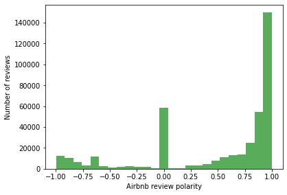
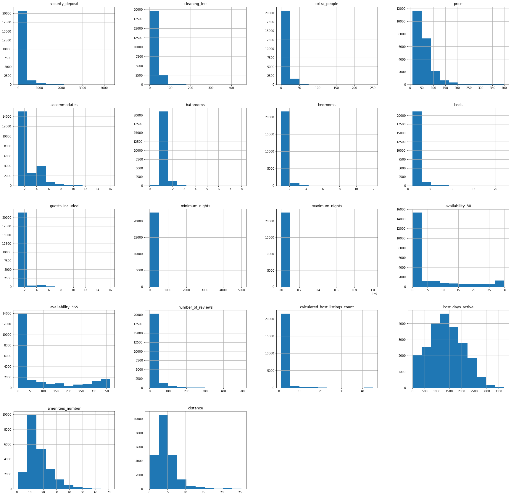
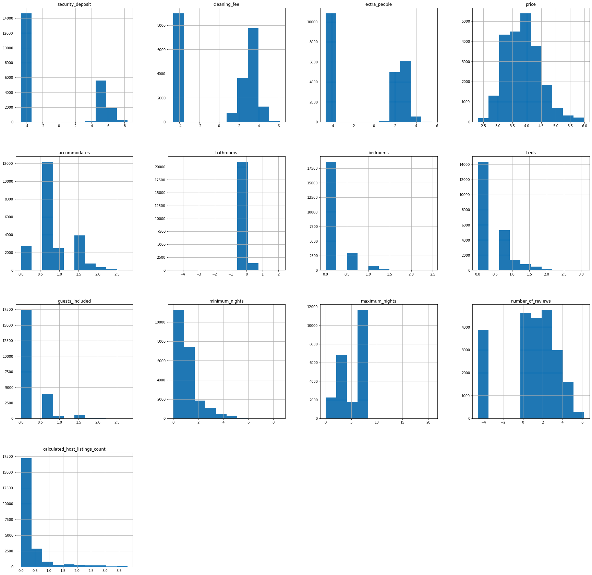

# **Final Project** 
### Bar Ilan Certified Data Science


# 1.Data Preparation
## Introduction

 Airbnb is the leading platform in providing lodging and tourism experience. Inside Airbnb’s business
logic, pricing is probably the most important for hosts and customers. Ensuring fair pricing directly
affects booking activities, and also matters to the well-being of the e-commerce environment. Thus,
studying the reasonable forecast and fair suggestion of prices of Airbnb listings can have huge real-life
values and may generalize to other applications as well.

Unlike hotels, which have their own pricing system, Aribnb prices are usually determined by the hosts empirically. It
poses challenges for the new hosts, as well as for existing hosts with new listings, to determine the prices reasonably high
yet without losing popularity. On the consumers’ side, though they can compare the price across other similar listings,
it is still valuable for them to know whether the current price is worthy and if it is a good time to book the rooms.

In this project, we build a price prediction model of Airbnb listings and make comparisons between
different methods.

This project aims to use machine learning  to predict the base price for properties in Berlin

---Data source Limitations -----
There are some limitations to the data in that I only used listings scraped in September 2019. Furthermore, while I wanted to model seasonality with time series, InsideAirBnB did not have a year’s worth of data for Tokyo.

Something to keep in mind is that modeling prices on all the scraped listings doesn’t make much sense. Many of these listings may be priced poorly or inactive and training a model on them wouldn’t necessarily suggest optimal prices. Therefore, defining what a “good” listing is and filtering out sub-optimal listings was the first step in the data cleaning process. One key feature to keep track of was occupancy, which wasn’t a feature included in the dataset.

## Importing the libraries and data


```python
#import pyodbc
from sqlalchemy import create_engine
import pandas as pd
import re
import numpy as np
from datetime import datetime
from geopy import distance
from geopy.distance import great_circle
from datetime import date
from sklearn.utils import shuffle
# Plotting
import matplotlib.pyplot as plt
import seaborn as sns
%matplotlib inline

from sklearn.decomposition import PCA, TruncatedSVD
from sklearn.preprocessing import LabelEncoder
from sklearn.preprocessing import OneHotEncoder
from sklearn.feature_extraction.text import TfidfVectorizer, CountVectorizer
from sklearn import linear_model
from sklearn.svm import SVR
import xgboost as xgb
from sklearn.ensemble import RandomForestRegressor
from sklearn.neighbors import KNeighborsRegressor
from sklearn.neural_network import MLPRegressor
import math
#from sqlalchemy import create_engine

from google.colab import drive
pd.set_option("display.max_rows", 1000)
pd.set_option("display.max_columns", None)


import warnings
warnings.filterwarnings("ignore", category=DeprecationWarning)

warnings.filterwarnings("ignore", category=FutureWarning)


#from google.colab import files
#uploaded = files.upload()

```

### Import Data From 'AirBnb' Database in *SSMS*


```python
server = '(localdb)\MSSQLLocalDB'
database = 'AirBnb'
cnxn = pyodbc.connect('DRIVER={ODBC Driver 17 for SQL Server};SERVER='+server+';DATABASE='+database+';Trusted_Connection=yes;')
cursor = cnxn.cursor()
```


```
df = '''
  SELECT [id],[host_since],[first_review],[last_review],[name],[summary],[space],
            [description]
            ,[neighborhood_overview],[notes],[transit],[access],[interaction],
            [house_rules],[host_name],[host_about],[security_deposit],[cleaning_fee],
            [extra_people],[price],[host_listings_count],[host_total_listings_count],
              [latitude],[longitude],[amenities],[host_verifications],[host_acceptance_rate],
            [host_response_rate],[accommodates],[bathrooms],[bedrooms],[beds],
            [square_feet],[guests_included],[minimum_nights],[maximum_nights],
            [availability_30],[availability_60],[availability_90],[availability_365],
            [number_of_reviews],[review_scores_rating],[review_scores_accuracy],
            [review_scores_cleanliness],[review_scores_checkin],
            [review_scores_communication],[review_scores_location],
            [review_scores_value],[calculated_host_listings_count],
            [reviews_per_month],[host_id],[host_location],[host_response_time],
            [host_is_superhost],[host_neighbourhood],[host_has_profile_pic],
            [host_identity_verified],[neighbourhood],[neighbourhood_cleansed],
            [neighbourhood_group_cleansed],[zipcode],[is_location_exact],
            [property_type],[room_type],[bed_type],[has_availability],
            [requires_license],[instant_bookable],[is_business_travel_ready],
            [cancellation_policy],[require_guest_profile_picture],
            [require_guest_phone_verification],[calendar_updated]
      FROM   [dbo].[listings_summary] AS [$Table] ''';

```


```python
df = pd.read_sql(df, cnxn)
```

```
df_r = '''
    SELECT  *
    FROM [AirBnb].[dbo].[reviews_summary]''';

```


```python
df_r = pd.read_sql(df_r, cnxn)
```

### Uploading saved queries


```python
df = pd.read_csv(r"C:\Users\oriwo\df.csv")
df_r = pd.read_csv(r"C:\Users\oriwo\df_r.csv")
a = pd.read_csv(r"C:\Users\oriwo\df_r_after_sentiment.csv")
varSel = pd.read_csv(r"C:\Users\oriwo\varSel.csv")
```


```python
drive.mount('/content/gdrive/')
path = '/content/gdrive/MyDrive/AirBnb/df.csv'
df = pd.read_csv(path)
path2 = '/content/gdrive/MyDrive/AirBnb/df_r.csv'
df_r = pd.read_csv(path2)

path3 =  '/content/gdrive/MyDrive/AirBnb/df_r_after_sentiment.csv'
a=pd.read_csv(path3)

path4 =  '/content/gdrive/MyDrive/AirBnb/varSel.csv'
varSel=pd.read_csv(path4)

```

    Drive already mounted at /content/gdrive/; to attempt to forcibly remount, call drive.mount("/content/gdrive/", force_remount=True).
    

# 2.Exploratory Data Analysis (EDA)


## pre-processing the data

initial columns to work with (by dtype)


```python
features = ['host_listings_count', 'host_total_listings_count', 'latitude', 'longitude', 
      'accommodates', 'bathrooms', 'bedrooms', 'beds', 'square_feet',     
      'guests_included', 'minimum_nights', 'maximum_nights', 'availability_30', 'availability_60', 
      'availability_90', 'availability_365', 'number_of_reviews', 'review_scores_rating', 'review_scores_accuracy', 
      'review_scores_cleanliness', 'review_scores_checkin', 'review_scores_communication', 'review_scores_location', 
      'review_scores_value', 'calculated_host_listings_count', 'reviews_per_month']

one_hot_col_names = ['host_id',  'host_location', 'host_response_time','host_is_superhost','host_neighbourhood','host_has_profile_pic','host_identity_verified',
           'neighbourhood','neighbourhood_cleansed','neighbourhood_group_cleansed', 'zipcode', 'is_location_exact', 'property_type', 'room_type', 'bed_type', 'has_availability', 'requires_license', 'instant_bookable', 
           'is_business_travel_ready',  'cancellation_policy','require_guest_profile_picture', 'require_guest_phone_verification', 'calendar_updated']
text_cols = ['name', 'summary', 'space', 'description', 'neighborhood_overview', 'notes', 'transit', 'access', 'interaction', 'house_rules', 'host_name', 'host_about']
date_cols = ['host_since', 'first_review', 'last_review']
price_features = ['security_deposit', 'cleaning_fee', 'extra_people','price']


booleans=['host_is_superhost', 'host_has_profile_pic','host_identity_verified','is_location_exact', 'has_availability', 'requires_license','instant_bookable', 'is_business_travel_ready',  'require_guest_profile_picture', 'require_guest_phone_verification']
lists = [features , one_hot_col_names , text_cols , date_cols , price_features]

```


```python
df.shape
```


    (22552, 73)


```python
df.head(1)
```


<div>
<style scoped>
    .dataframe tbody tr th:only-of-type {
        vertical-align: middle;
    }

    .dataframe tbody tr th {
        vertical-align: top;
    }

    .dataframe thead th {
        text-align: right;
    }
</style>
<table border="1" class="dataframe">
  <thead>
    <tr style="text-align: right;">
      <th></th>
      <th>id</th>
      <th>host_since</th>
      <th>first_review</th>
      <th>last_review</th>
      <th>name</th>
      <th>summary</th>
      <th>space</th>
      <th>description</th>
      <th>neighborhood_overview</th>
      <th>notes</th>
      <th>transit</th>
      <th>access</th>
      <th>interaction</th>
      <th>house_rules</th>
      <th>host_name</th>
      <th>host_about</th>
      <th>security_deposit</th>
      <th>cleaning_fee</th>
      <th>extra_people</th>
      <th>price</th>
      <th>host_listings_count</th>
      <th>host_total_listings_count</th>
      <th>latitude</th>
      <th>longitude</th>
      <th>amenities</th>
      <th>host_verifications</th>
      <th>host_acceptance_rate</th>
      <th>host_response_rate</th>
      <th>accommodates</th>
      <th>bathrooms</th>
      <th>bedrooms</th>
      <th>beds</th>
      <th>square_feet</th>
      <th>guests_included</th>
      <th>minimum_nights</th>
      <th>maximum_nights</th>
      <th>availability_30</th>
      <th>availability_60</th>
      <th>availability_90</th>
      <th>availability_365</th>
      <th>number_of_reviews</th>
      <th>review_scores_rating</th>
      <th>review_scores_accuracy</th>
      <th>review_scores_cleanliness</th>
      <th>review_scores_checkin</th>
      <th>review_scores_communication</th>
      <th>review_scores_location</th>
      <th>review_scores_value</th>
      <th>calculated_host_listings_count</th>
      <th>reviews_per_month</th>
      <th>host_id</th>
      <th>host_location</th>
      <th>host_response_time</th>
      <th>host_is_superhost</th>
      <th>host_neighbourhood</th>
      <th>host_has_profile_pic</th>
      <th>host_identity_verified</th>
      <th>neighbourhood</th>
      <th>neighbourhood_cleansed</th>
      <th>neighbourhood_group_cleansed</th>
      <th>zipcode</th>
      <th>is_location_exact</th>
      <th>property_type</th>
      <th>room_type</th>
      <th>bed_type</th>
      <th>has_availability</th>
      <th>requires_license</th>
      <th>instant_bookable</th>
      <th>is_business_travel_ready</th>
      <th>cancellation_policy</th>
      <th>require_guest_profile_picture</th>
      <th>require_guest_phone_verification</th>
      <th>calendar_updated</th>
    </tr>
  </thead>
  <tbody>
    <tr>
      <th>0</th>
      <td>13011494</td>
      <td>2012-12-11</td>
      <td>2017-07-18</td>
      <td>2018-07-25</td>
      <td>Bright and spacious room wth balcony and roof ...</td>
      <td>The apartment is located in Neukölln (Kreuzköl...</td>
      <td>The 60sqm, two-bedroom flat offers space for m...</td>
      <td>The apartment is located in Neukölln (Kreuzköl...</td>
      <td>-Shops, restaurants, bars, clubs, galleries, t...</td>
      <td>Please notice! There is no elevator. During yo...</td>
      <td>-Free parking on the streets -U-Bahn stations ...</td>
      <td>Access to shared kitchen and bathroom.</td>
      <td>Since I wont be at home myself, the communicat...</td>
      <td>-Feel like home, but respect the home and poss...</td>
      <td>Svenja</td>
      <td>Hello!\r\n\r\nI am a dance teacher, a travelli...</td>
      <td>$250.00</td>
      <td>$20.00</td>
      <td>$10.00</td>
      <td>$40.00</td>
      <td>2.0</td>
      <td>2.0</td>
      <td>52.492309</td>
      <td>13.427217</td>
      <td>{Wifi,Kitchen,"Free street parking","Buzzer/wi...</td>
      <td>['email', 'phone', 'reviews']</td>
      <td>NaN</td>
      <td>NaN</td>
      <td>1</td>
      <td>1.0</td>
      <td>1.0</td>
      <td>1.0</td>
      <td>NaN</td>
      <td>1</td>
      <td>4</td>
      <td>30</td>
      <td>0</td>
      <td>0</td>
      <td>0</td>
      <td>0</td>
      <td>8</td>
      <td>100.0</td>
      <td>10.0</td>
      <td>10.0</td>
      <td>10.0</td>
      <td>10.0</td>
      <td>9.0</td>
      <td>10.0</td>
      <td>2</td>
      <td>0.5</td>
      <td>4379053</td>
      <td>Berlin, Berlin, Germany</td>
      <td>NaN</td>
      <td>f</td>
      <td>NaN</td>
      <td>t</td>
      <td>f</td>
      <td>Neukölln</td>
      <td>Reuterstraße</td>
      <td>Neukölln</td>
      <td>12047</td>
      <td>f</td>
      <td>Apartment</td>
      <td>Private room</td>
      <td>Real Bed</td>
      <td>t</td>
      <td>t</td>
      <td>f</td>
      <td>f</td>
      <td>moderate</td>
      <td>f</td>
      <td>f</td>
      <td>4 months ago</td>
    </tr>
  </tbody>
</table>
</div>


```python
df.isna().sum().sort_values(ascending =False)
```


    host_acceptance_rate                22552
    square_feet                         22106
    notes                               15337
    host_response_rate                  12895
    host_response_time                  12894
    interaction                         12146
    access                              11715
    host_about                          11378
    house_rules                         11103
    neighborhood_overview               11012
    transit                              9516
    security_deposit                     9361
    space                                8532
    cleaning_fee                         7146
    host_neighbourhood                   5094
    review_scores_value                  4435
    review_scores_checkin                4432
    review_scores_location               4431
    review_scores_communication          4418
    review_scores_accuracy               4414
    review_scores_cleanliness            4411
    review_scores_rating                 4389
    reviews_per_month                    3914
    first_review                         3914
    last_review                          3908
    neighbourhood                        1131
    summary                               963
    zipcode                               656
    description                           203
    host_location                         116
    name                                   59
    beds                                   40
    bathrooms                              32
    host_identity_verified                 26
    host_has_profile_pic                   26
    host_is_superhost                      26
    host_name                              26
    host_since                             26
    host_listings_count                    26
    host_total_listings_count              26
    bedrooms                               18
    longitude                               0
    amenities                               0
    extra_people                            0
    latitude                                0
    price                                   0
    calendar_updated                        0
    availability_30                         0
    host_verifications                      0
    neighbourhood_group_cleansed            0
    require_guest_profile_picture           0
    cancellation_policy                     0
    is_business_travel_ready                0
    instant_bookable                        0
    requires_license                        0
    has_availability                        0
    bed_type                                0
    room_type                               0
    property_type                           0
    is_location_exact                       0
    neighbourhood_cleansed                  0
    accommodates                            0
    host_id                                 0
    calculated_host_listings_count          0
    number_of_reviews                       0
    availability_365                        0
    availability_90                         0
    availability_60                         0
    require_guest_phone_verification        0
    maximum_nights                          0
    minimum_nights                          0
    guests_included                         0
    id                                      0
    dtype: int64


### functions


```python
def obj_to_num(to_numbers):
    
#    df['host_id'] = df['host_id'].astype(str)
    for i in range(len(to_numbers)):
        if to_numbers[i] in df.columns:
            
            df[to_numbers[i]] = df[to_numbers[i]].astype('float64',errors='ignore')
#    for j in range(len(to_one_hot)):
 #       df[to_one_hot[j]].replace({'f': 0, 't': 1}, inplace=True)
```


```python
def booleans_to_numbers(s):
    if s == 'f':
        return int(0)
    elif s == 't':
        return int(1)
    return None
    
```


```python
def update_columns(drop_list):
#    lists = [features , one_hot_col_names , text_cols , date_cols , price_features]
    for list in lists:
        for f in list:
            if f in drop_list:
                list.remove(f)
    df.drop(columns = drop_list, inplace=True)
```


```python
def price_clean(arr):
    for i in arr:
        df[i].fillna('$0.00', inplace=True)
        df[i] = df[i].str.replace('$', '').str.replace(',', '').astype(float)
        df[i] = df[i].astype('int64')

```


```python
def bin_column(col, bins, labels, na_label='unknown'):
    """
    Takes in a column name, bin cut points and labels, replaces the original column with a
    binned version, and replaces nulls (with 'unknown' if unspecified).
    """
    df[col] = pd.cut(df[col], bins=bins, labels=labels, include_lowest=True)
    df[col] = df[col].astype('str')
    df[col].fillna(na_label, inplace=True)
```

###dropping Unnecessary columns

removing columns with to many null values


```python
df.isna().sum().sort_values(ascending =False)
df.drop(['host_acceptance_rate','square_feet'], axis=1, inplace=True)

```

text columns will be dropped for now - not useful for predicting price


```python
df = df.drop(text_cols, axis=1)
```

removing columns with similar data


```python
df.drop(['host_total_listings_count', 'host_listings_count'], axis=1, inplace=True)
```

Replacing columns with f/t with 0/1


```python
for col in booleans:
    df[col] = df[col].apply(booleans_to_numbers)
```

Plotting the distribution of numerical and boolean categories


```python
#Checking whether boolean and categorical features contain sufficient numbers of instances in each category to make them worth including:
df.hist(figsize=(20,20),color ='g' );
```


    

    


From the above, it can be seen that several columns only contain one category and can be dropped:


```python
colls_to_drop1=['has_availability','host_id','requires_license','is_business_travel_ready','require_guest_phone_verification','require_guest_profile_picture','host_has_profile_pic']
df.drop(colls_to_drop1, axis=1, inplace=True)
df.drop(['host_response_rate','zipcode','host_neighbourhood','neighbourhood','host_location'], axis=1, inplace=True)

```


```python
df.isnull().sum()
```


    id                                    0
    host_since                           26
    first_review                       3914
    last_review                        3908
    security_deposit                   9361
    cleaning_fee                       7146
    extra_people                          0
    price                                 0
    latitude                              0
    longitude                             0
    amenities                             0
    host_verifications                    0
    accommodates                          0
    bathrooms                            32
    bedrooms                             18
    beds                                 40
    guests_included                       0
    minimum_nights                        0
    maximum_nights                        0
    availability_30                       0
    availability_60                       0
    availability_90                       0
    availability_365                      0
    number_of_reviews                     0
    review_scores_rating               4389
    review_scores_accuracy             4414
    review_scores_cleanliness          4411
    review_scores_checkin              4432
    review_scores_communication        4418
    review_scores_location             4431
    review_scores_value                4435
    calculated_host_listings_count        0
    reviews_per_month                  3914
    host_response_time                12894
    host_is_superhost                    26
    host_identity_verified               26
    neighbourhood_cleansed                0
    neighbourhood_group_cleansed          0
    is_location_exact                     0
    property_type                         0
    room_type                             0
    bed_type                              0
    instant_bookable                      0
    cancellation_policy                   0
    calendar_updated                      0
    dtype: int64


### cleaning other columns

##### is_location_exact


```python
df.is_location_exact.value_counts(normalize=True,dropna=False)
```


    1    0.743881
    0    0.256119
    Name: is_location_exact, dtype: float64


#####host_identity_verified


```python
df.host_identity_verified.value_counts(dropna=False)
```


    0.0    13824
    1.0     8702
    NaN       26
    Name: host_identity_verified, dtype: int64


#####instant_bookable


```python
df.instant_bookable.value_counts(normalize=True,dropna=False)
```


    0    0.688099
    1    0.311901
    Name: instant_bookable, dtype: float64


#####host_response_time


```python
df.host_response_time.value_counts(normalize=True,dropna=False)
```


    NaN                   0.571745
    within an hour        0.225302
    within a few hours    0.094315
    within a day          0.091344
    a few days or more    0.017293
    Name: host_response_time, dtype: float64


```python
df.host_response_time.fillna("unknown", inplace=True)
#df.host_response_time.replace({ 'N/A': 'unknown'}, inplace=True)
df.host_response_time.value_counts(normalize=True,dropna=False)
```


    unknown               0.571745
    within an hour        0.225302
    within a few hours    0.094315
    within a day          0.091344
    a few days or more    0.017293
    Name: host_response_time, dtype: float64


#####host_is_superhost


```python
df['host_is_superhost'].value_counts(dropna=False)
```


    0.0    19515
    1.0     3011
    NaN       26
    Name: host_is_superhost, dtype: int64


```python
#df.host_is_superhost.fillna(0, inplace=True)
```

#####room_type


```python
df['room_type'].value_counts(normalize=True,dropna=False)
```


    Private room       0.511440
    Entire home/apt    0.475435
    Shared room        0.013125
    Name: room_type, dtype: float64


#####calculated_host_listings_count


```python
df['calculated_host_listings_count'].describe()
```


    count    22552.000000
    mean         1.918233
    std          3.667257
    min          1.000000
    25%          1.000000
    50%          1.000000
    75%          1.000000
    max         45.000000
    Name: calculated_host_listings_count, dtype: float64


```python
df['calculated_host_listings_count'].value_counts(normalize=True,dropna=False)
```


    1     0.764367
    2     0.127882
    3     0.035651
    4     0.014544
    5     0.010199
    6     0.007183
    7     0.006208
    9     0.003991
    8     0.003902
    19    0.003370
    12    0.003193
    17    0.003015
    10    0.002217
    45    0.001995
    11    0.001951
    43    0.001907
    16    0.001419
    30    0.001330
    15    0.001330
    14    0.001242
    26    0.001153
    13    0.001153
    18    0.000798
    Name: calculated_host_listings_count, dtype: float64


#####property_type


```python
# property_type 
df['property_type'].value_counts(normalize=True,dropna=False)
```


    Apartment                 0.896816
    Condominium               0.027137
    Loft                      0.020397
    House                     0.017648
    Serviced apartment        0.007760
    Hostel                    0.005676
    Townhouse                 0.004390
    Guest suite               0.003281
    Bed and breakfast         0.002838
    Guesthouse                0.002527
    Hotel                     0.002217
    Other                     0.002084
    Boutique hotel            0.001907
    Bungalow                  0.000887
    Boat                      0.000754
    Tiny house                0.000532
    Houseboat                 0.000488
    Camper/RV                 0.000488
    Villa                     0.000443
    Aparthotel                0.000310
    Pension (South Korea)     0.000310
    Cabin                     0.000266
    Cottage                   0.000177
    Resort                    0.000133
    Castle                    0.000089
    Casa particular (Cuba)    0.000089
    Train                     0.000089
    Chalet                    0.000044
    Tipi                      0.000044
    Island                    0.000044
    Cave                      0.000044
    Barn                      0.000044
    In-law                    0.000044
    Name: property_type, dtype: float64


```python
# Replacing categories that are types of houses or apartments
df.property_type.replace({
    'Condominium': 'Apartment',
    'Loft': 'Apartment',
    'House': 'House',
    'Townhouse': 'House',
    'Serviced apartment': 'Apartment',
    'Cottage': 'House',
    'Villa': 'House',
    'Tiny house': 'House',
    'Aparthotel': 'Apartment',
    'Bungalow' : 'House'
    
    }, inplace=True)

# Replacing other categories with 'other'
df.loc[~df.property_type.isin(['House', 'Apartment']), 'property_type'] = 'Other'
```


```python
df['property_type'].value_counts(normalize=True,dropna=False)
```


    Apartment    0.952421
    House        0.024078
    Other        0.023501
    Name: property_type, dtype: float64


#####calendar_updated


```python
# calendar_updated ----> NAN can be assumed to be 0
df['calendar_updated'].value_counts(normalize=True,dropna=False)
```


    today            0.111609
    2 weeks ago      0.059330
    a week ago       0.057245
    2 months ago     0.049175
    3 weeks ago      0.044918
    3 months ago     0.044431
    yesterday        0.041992
    4 months ago     0.040795
    4 weeks ago      0.032636
    5 months ago     0.024965
    3 days ago       0.023058
    8 months ago     0.022393
    5 weeks ago      0.021506
    2 days ago       0.021462
    6 weeks ago      0.020663
    6 months ago     0.020530
    11 months ago    0.020087
    7 months ago     0.019333
    5 days ago       0.017471
    15 months ago    0.016761
    9 months ago     0.016185
    10 months ago    0.016140
    4 days ago       0.015786
    14 months ago    0.014677
    12 months ago    0.013258
    16 months ago    0.011662
    13 months ago    0.011485
    7 weeks ago      0.010553
    35 months ago    0.009267
    18 months ago    0.008868
    19 months ago    0.008336
    28 months ago    0.008336
    27 months ago    0.008292
    33 months ago    0.008070
    17 months ago    0.007538
    21 months ago    0.007494
    32 months ago    0.007228
    34 months ago    0.006873
    20 months ago    0.006651
    22 months ago    0.006518
    31 months ago    0.006297
    26 months ago    0.006252
    39 months ago    0.006119
    1 week ago       0.005809
    23 months ago    0.005720
    29 months ago    0.005410
    40 months ago    0.005410
    24 months ago    0.005099
    37 months ago    0.005055
    6 days ago       0.004833
    25 months ago    0.004789
    38 months ago    0.004789
    30 months ago    0.004390
    36 months ago    0.004168
    41 months ago    0.002661
    42 months ago    0.002084
    never            0.001463
    46 months ago    0.001330
    44 months ago    0.000976
    45 months ago    0.000887
    47 months ago    0.000754
    43 months ago    0.000709
    48 months ago    0.000355
    51 months ago    0.000222
    49 months ago    0.000133
    52 months ago    0.000089
    53 months ago    0.000089
    58 months ago    0.000089
    59 months ago    0.000089
    55 months ago    0.000089
    57 months ago    0.000089
    54 months ago    0.000044
    79 months ago    0.000044
    73 months ago    0.000044
    50 months ago    0.000044
    Name: calendar_updated, dtype: float64


```python
# Replacing categories refering to this week (the last 7 days)
df.calendar_updated.replace({
    'yesterday': 'This week',
    'a week ago': 'This week',
    '4 days ago': 'This week',
    '3 days ago': 'This week',
    '5 days ago': 'This week',
    '6 days ago': 'This week',
    '1 week ago': 'This week'
    
    }, inplace=True)

# Replacing rest categories of more than a month
df.loc[~df.calendar_updated.isin(['This week', 'today','2 weeks ago','3 weeks ago','4 weeks ago']), 'calendar_updated'] = 'more then a month ago'
```


```python
df['calendar_updated'].value_counts(normalize=True,dropna=False)
```


    more then a month ago    0.585314
    This week                0.166194
    today                    0.111609
    2 weeks ago              0.059330
    3 weeks ago              0.044918
    4 weeks ago              0.032636
    Name: calendar_updated, dtype: float64


```python
# one_hot_col_names = ['host_id',  'host_location', 'host_response_time','host_is_superhost','host_neighbourhood','host_has_profile_pic','host_identity_verified',
#          'neighbourhood','neighbourhood_cleansed','neighbourhood_group_cleansed', 'zipcode', 'is_location_exact', 'property_type', 'room_type', 'bed_type',   'instant_bookable', 
#           'cancellation_policy', 'calendar_updated']
```


```python
df.shape
```


    (22552, 45)


```python
df_2=df.copy()
```


```python
df.isna().sum().sort_values(ascending =False)
```


    security_deposit                  9361
    cleaning_fee                      7146
    review_scores_value               4435
    review_scores_checkin             4432
    review_scores_location            4431
    review_scores_communication       4418
    review_scores_accuracy            4414
    review_scores_cleanliness         4411
    review_scores_rating              4389
    reviews_per_month                 3914
    first_review                      3914
    last_review                       3908
    beds                                40
    bathrooms                           32
    host_identity_verified              26
    host_since                          26
    host_is_superhost                   26
    bedrooms                            18
    host_verifications                   0
    accommodates                         0
    amenities                            0
    calendar_updated                     0
    guests_included                      0
    latitude                             0
    price                                0
    extra_people                         0
    longitude                            0
    availability_365                     0
    minimum_nights                       0
    neighbourhood_cleansed               0
    instant_bookable                     0
    bed_type                             0
    room_type                            0
    property_type                        0
    is_location_exact                    0
    neighbourhood_group_cleansed         0
    host_response_time                   0
    maximum_nights                       0
    calculated_host_listings_count       0
    number_of_reviews                    0
    cancellation_policy                  0
    availability_90                      0
    availability_60                      0
    availability_30                      0
    id                                   0
    dtype: int64


#####cancellation_policy


```python
df.cancellation_policy.value_counts()

```


    flexible                       9102
    moderate                       7096
    strict_14_with_grace_period    6287
    super_strict_30                  53
    super_strict_60                  14
    Name: cancellation_policy, dtype: int64


```python
# Replacing categories
df.cancellation_policy.replace({
    'super_strict_30': 'strict',
    'super_strict_60': 'strict',
    'strict_14_with_grace_period': 'strict_with_grace_period'
    
    }, inplace=True)
```


```python
df.info()
```

    <class 'pandas.core.frame.DataFrame'>
    RangeIndex: 22552 entries, 0 to 22551
    Data columns (total 45 columns):
     #   Column                          Non-Null Count  Dtype  
    ---  ------                          --------------  -----  
     0   id                              22552 non-null  int64  
     1   host_since                      22526 non-null  object 
     2   first_review                    18638 non-null  object 
     3   last_review                     18644 non-null  object 
     4   security_deposit                13191 non-null  object 
     5   cleaning_fee                    15406 non-null  object 
     6   extra_people                    22552 non-null  object 
     7   price                           22552 non-null  object 
     8   latitude                        22552 non-null  float64
     9   longitude                       22552 non-null  float64
     10  amenities                       22552 non-null  object 
     11  host_verifications              22552 non-null  object 
     12  accommodates                    22552 non-null  int64  
     13  bathrooms                       22520 non-null  float64
     14  bedrooms                        22534 non-null  float64
     15  beds                            22512 non-null  float64
     16  guests_included                 22552 non-null  int64  
     17  minimum_nights                  22552 non-null  int64  
     18  maximum_nights                  22552 non-null  int64  
     19  availability_30                 22552 non-null  int64  
     20  availability_60                 22552 non-null  int64  
     21  availability_90                 22552 non-null  int64  
     22  availability_365                22552 non-null  int64  
     23  number_of_reviews               22552 non-null  int64  
     24  review_scores_rating            18163 non-null  float64
     25  review_scores_accuracy          18138 non-null  float64
     26  review_scores_cleanliness       18141 non-null  float64
     27  review_scores_checkin           18120 non-null  float64
     28  review_scores_communication     18134 non-null  float64
     29  review_scores_location          18121 non-null  float64
     30  review_scores_value             18117 non-null  float64
     31  calculated_host_listings_count  22552 non-null  int64  
     32  reviews_per_month               18638 non-null  float64
     33  host_response_time              22552 non-null  object 
     34  host_is_superhost               22526 non-null  float64
     35  host_identity_verified          22526 non-null  float64
     36  neighbourhood_cleansed          22552 non-null  object 
     37  neighbourhood_group_cleansed    22552 non-null  object 
     38  is_location_exact               22552 non-null  int64  
     39  property_type                   22552 non-null  object 
     40  room_type                       22552 non-null  object 
     41  bed_type                        22552 non-null  object 
     42  instant_bookable                22552 non-null  int64  
     43  cancellation_policy             22552 non-null  object 
     44  calendar_updated                22552 non-null  object 
    dtypes: float64(15), int64(13), object(17)
    memory usage: 7.7+ MB
    

#####'accommodates', 'bathrooms', 'bedrooms', 'beds'


```python
# 'accommodates', 'bathrooms', 'bedrooms', 'beds' 
df[['accommodates', 'bathrooms', 'bedrooms', 'beds']].describe().T
```


<div>
<style scoped>
    .dataframe tbody tr th:only-of-type {
        vertical-align: middle;
    }

    .dataframe tbody tr th {
        vertical-align: top;
    }

    .dataframe thead th {
        text-align: right;
    }
</style>
<table border="1" class="dataframe">
  <thead>
    <tr style="text-align: right;">
      <th></th>
      <th>count</th>
      <th>mean</th>
      <th>std</th>
      <th>min</th>
      <th>25%</th>
      <th>50%</th>
      <th>75%</th>
      <th>max</th>
    </tr>
  </thead>
  <tbody>
    <tr>
      <th>accommodates</th>
      <td>22552.0</td>
      <td>2.637460</td>
      <td>1.510548</td>
      <td>1.0</td>
      <td>2.0</td>
      <td>2.0</td>
      <td>3.0</td>
      <td>16.0</td>
    </tr>
    <tr>
      <th>bathrooms</th>
      <td>22520.0</td>
      <td>1.092695</td>
      <td>0.329894</td>
      <td>0.0</td>
      <td>1.0</td>
      <td>1.0</td>
      <td>1.0</td>
      <td>8.5</td>
    </tr>
    <tr>
      <th>bedrooms</th>
      <td>22534.0</td>
      <td>1.161134</td>
      <td>0.646156</td>
      <td>0.0</td>
      <td>1.0</td>
      <td>1.0</td>
      <td>1.0</td>
      <td>12.0</td>
    </tr>
    <tr>
      <th>beds</th>
      <td>22512.0</td>
      <td>1.620558</td>
      <td>1.174840</td>
      <td>0.0</td>
      <td>1.0</td>
      <td>1.0</td>
      <td>2.0</td>
      <td>22.0</td>
    </tr>
  </tbody>
</table>
</div>


```python
# listingds with 0 beds are probably mistake, so theyll get the median value 
df.loc[(df['bedrooms'].isnull() | df['bedrooms'] == 0) , ['bed_type','beds','bedrooms']]
```


<div>
<style scoped>
    .dataframe tbody tr th:only-of-type {
        vertical-align: middle;
    }

    .dataframe tbody tr th {
        vertical-align: top;
    }

    .dataframe thead th {
        text-align: right;
    }
</style>
<table border="1" class="dataframe">
  <thead>
    <tr style="text-align: right;">
      <th></th>
      <th>bed_type</th>
      <th>beds</th>
      <th>bedrooms</th>
    </tr>
  </thead>
  <tbody>
    <tr>
      <th>35</th>
      <td>Real Bed</td>
      <td>1.0</td>
      <td>0.0</td>
    </tr>
    <tr>
      <th>42</th>
      <td>Pull-out Sofa</td>
      <td>1.0</td>
      <td>0.0</td>
    </tr>
    <tr>
      <th>82</th>
      <td>Real Bed</td>
      <td>1.0</td>
      <td>0.0</td>
    </tr>
    <tr>
      <th>87</th>
      <td>Real Bed</td>
      <td>3.0</td>
      <td>0.0</td>
    </tr>
    <tr>
      <th>95</th>
      <td>Real Bed</td>
      <td>1.0</td>
      <td>0.0</td>
    </tr>
    <tr>
      <th>...</th>
      <td>...</td>
      <td>...</td>
      <td>...</td>
    </tr>
    <tr>
      <th>22435</th>
      <td>Real Bed</td>
      <td>2.0</td>
      <td>0.0</td>
    </tr>
    <tr>
      <th>22452</th>
      <td>Real Bed</td>
      <td>1.0</td>
      <td>0.0</td>
    </tr>
    <tr>
      <th>22469</th>
      <td>Real Bed</td>
      <td>2.0</td>
      <td>0.0</td>
    </tr>
    <tr>
      <th>22483</th>
      <td>Real Bed</td>
      <td>1.0</td>
      <td>0.0</td>
    </tr>
    <tr>
      <th>22547</th>
      <td>Real Bed</td>
      <td>2.0</td>
      <td>0.0</td>
    </tr>
  </tbody>
</table>
<p>1477 rows × 3 columns</p>
</div>


```python
#Nans values will get the median and 0 values will get 1 (the realistic min)
for col in ['bathrooms', 'bedrooms', 'beds']:
    df[col].fillna(df[col].median(), inplace=True)
    df[col].replace({0: 1}, inplace=True)
    df[col] = df[col].astype('int64')
```


```python
df[['accommodates', 'bathrooms', 'bedrooms', 'beds']].describe().T
```


<div>
<style scoped>
    .dataframe tbody tr th:only-of-type {
        vertical-align: middle;
    }

    .dataframe tbody tr th {
        vertical-align: top;
    }

    .dataframe thead th {
        text-align: right;
    }
</style>
<table border="1" class="dataframe">
  <thead>
    <tr style="text-align: right;">
      <th></th>
      <th>count</th>
      <th>mean</th>
      <th>std</th>
      <th>min</th>
      <th>25%</th>
      <th>50%</th>
      <th>75%</th>
      <th>max</th>
    </tr>
  </thead>
  <tbody>
    <tr>
      <th>accommodates</th>
      <td>22552.0</td>
      <td>2.637460</td>
      <td>1.510548</td>
      <td>1.0</td>
      <td>2.0</td>
      <td>2.0</td>
      <td>3.0</td>
      <td>16.0</td>
    </tr>
    <tr>
      <th>bathrooms</th>
      <td>22552.0</td>
      <td>1.064828</td>
      <td>0.309719</td>
      <td>0.0</td>
      <td>1.0</td>
      <td>1.0</td>
      <td>1.0</td>
      <td>8.0</td>
    </tr>
    <tr>
      <th>bedrooms</th>
      <td>22552.0</td>
      <td>1.226499</td>
      <td>0.571252</td>
      <td>1.0</td>
      <td>1.0</td>
      <td>1.0</td>
      <td>1.0</td>
      <td>12.0</td>
    </tr>
    <tr>
      <th>beds</th>
      <td>22552.0</td>
      <td>1.620876</td>
      <td>1.172734</td>
      <td>1.0</td>
      <td>1.0</td>
      <td>1.0</td>
      <td>2.0</td>
      <td>22.0</td>
    </tr>
  </tbody>
</table>
</div>


#####price


```python
price_clean(price_features)
df[['security_deposit', 'cleaning_fee', 'extra_people','price']].describe().T
```


<div>
<style scoped>
    .dataframe tbody tr th:only-of-type {
        vertical-align: middle;
    }

    .dataframe tbody tr th {
        vertical-align: top;
    }

    .dataframe thead th {
        text-align: right;
    }
</style>
<table border="1" class="dataframe">
  <thead>
    <tr style="text-align: right;">
      <th></th>
      <th>count</th>
      <th>mean</th>
      <th>std</th>
      <th>min</th>
      <th>25%</th>
      <th>50%</th>
      <th>75%</th>
      <th>max</th>
    </tr>
  </thead>
  <tbody>
    <tr>
      <th>security_deposit</th>
      <td>22552.0</td>
      <td>118.284454</td>
      <td>304.232661</td>
      <td>0.0</td>
      <td>0.0</td>
      <td>0.0</td>
      <td>150.0</td>
      <td>4280.0</td>
    </tr>
    <tr>
      <th>cleaning_fee</th>
      <td>22552.0</td>
      <td>18.253991</td>
      <td>28.172816</td>
      <td>0.0</td>
      <td>0.0</td>
      <td>10.0</td>
      <td>30.0</td>
      <td>2000.0</td>
    </tr>
    <tr>
      <th>extra_people</th>
      <td>22552.0</td>
      <td>8.257716</td>
      <td>11.151069</td>
      <td>0.0</td>
      <td>0.0</td>
      <td>5.0</td>
      <td>15.0</td>
      <td>250.0</td>
    </tr>
    <tr>
      <th>price</th>
      <td>22552.0</td>
      <td>67.143668</td>
      <td>220.266210</td>
      <td>0.0</td>
      <td>30.0</td>
      <td>45.0</td>
      <td>70.0</td>
      <td>9000.0</td>
    </tr>
  </tbody>
</table>
</div>


```python
df.info()
```

    <class 'pandas.core.frame.DataFrame'>
    RangeIndex: 22552 entries, 0 to 22551
    Data columns (total 45 columns):
     #   Column                          Non-Null Count  Dtype  
    ---  ------                          --------------  -----  
     0   id                              22552 non-null  int64  
     1   host_since                      22526 non-null  object 
     2   first_review                    18638 non-null  object 
     3   last_review                     18644 non-null  object 
     4   security_deposit                22552 non-null  int64  
     5   cleaning_fee                    22552 non-null  int64  
     6   extra_people                    22552 non-null  int64  
     7   price                           22552 non-null  int64  
     8   latitude                        22552 non-null  float64
     9   longitude                       22552 non-null  float64
     10  amenities                       22552 non-null  object 
     11  host_verifications              22552 non-null  object 
     12  accommodates                    22552 non-null  int64  
     13  bathrooms                       22552 non-null  int64  
     14  bedrooms                        22552 non-null  int64  
     15  beds                            22552 non-null  int64  
     16  guests_included                 22552 non-null  int64  
     17  minimum_nights                  22552 non-null  int64  
     18  maximum_nights                  22552 non-null  int64  
     19  availability_30                 22552 non-null  int64  
     20  availability_60                 22552 non-null  int64  
     21  availability_90                 22552 non-null  int64  
     22  availability_365                22552 non-null  int64  
     23  number_of_reviews               22552 non-null  int64  
     24  review_scores_rating            18163 non-null  float64
     25  review_scores_accuracy          18138 non-null  float64
     26  review_scores_cleanliness       18141 non-null  float64
     27  review_scores_checkin           18120 non-null  float64
     28  review_scores_communication     18134 non-null  float64
     29  review_scores_location          18121 non-null  float64
     30  review_scores_value             18117 non-null  float64
     31  calculated_host_listings_count  22552 non-null  int64  
     32  reviews_per_month               18638 non-null  float64
     33  host_response_time              22552 non-null  object 
     34  host_is_superhost               22526 non-null  float64
     35  host_identity_verified          22526 non-null  float64
     36  neighbourhood_cleansed          22552 non-null  object 
     37  neighbourhood_group_cleansed    22552 non-null  object 
     38  is_location_exact               22552 non-null  int64  
     39  property_type                   22552 non-null  object 
     40  room_type                       22552 non-null  object 
     41  bed_type                        22552 non-null  object 
     42  instant_bookable                22552 non-null  int64  
     43  cancellation_policy             22552 non-null  object 
     44  calendar_updated                22552 non-null  object 
    dtypes: float64(12), int64(20), object(13)
    memory usage: 7.7+ MB
    


```python
df.loc[df.price <= 10, 'price'] = 10
df.loc[df.price >= 400, 'price'] = 400
```

#####host_since


```python

```


```python
# Converting to datetime
df.host_since = pd.to_datetime(df.host_since) 

# Calculating the number of days
df['host_days_active'] = (datetime(2018, 11, 7) - df.host_since).astype('timedelta64[D]')

# Printing mean and median
print("Mean days as host:", round(df['host_days_active'].mean(),0))
print("Median days as host:", df['host_days_active'].median())

# Replacing null values with the median
df.host_days_active.fillna(df.host_days_active.median(), inplace=True)
df.host_days_active=df.host_days_active.astype('int64')
```

    Mean days as host: 1346.0
    Median days as host: 1289.0
    


```python
df.dropna(subset=['host_since'], inplace=True)

```

#####first_review and last_review


```python
print(f"Null values in 'first_review': {round(100*df.first_review.isna().sum()/len(df),1)}%")
print(f"Null values in 'review_scores_rating': {round(100*df.review_scores_rating .isna().sum()/len(df),1)}%")
```

    Null values in 'first_review': 17.3%
    Null values in 'review_scores_rating': 19.4%
    


```python
df.first_review = pd.to_datetime(df.first_review) # Converting to datetime

# Calculating the number of days between the first review and the date the data was scraped
df['time_since_first_review'] = (datetime(2018, 11, 7) - df.first_review).astype('timedelta64[D]')
```


```python
# Distribution of the number of days since first review
df.time_since_first_review.hist(figsize=(15,5), bins=30);
```


    

    


```python
def bin_column(col, bins, labels, na_label='unknown'):
    """
    Takes in a column name, bin cut points and labels, replaces the original column with a
    binned version, and replaces nulls (with 'unknown' if unspecified).
    """
    df[col] = pd.cut(df[col], bins=bins, labels=labels, include_lowest=True)
    df[col] = df[col].astype('str')
    df[col].fillna(na_label, inplace=True)
```


```python
# Binning time since first review
bin_column('time_since_first_review',
           bins=[0, 182, 365, 730, 1460, max(df.time_since_first_review)],
           labels=['0-6 months',
                   '6-12 months',
                   '1-2 years',
                   '2-3 years',
                   '4+ years'],
           na_label='no reviews')
```


```python
df.last_review = pd.to_datetime(df.last_review) # Converting to datetime

# Calculating the number of days between the most recent review and the date the data was scraped
df['time_since_last_review'] = (datetime(2018, 11, 7) - df.last_review).astype('timedelta64[D]')
```


```python
# Distribution of the number of days since last review
df.time_since_last_review.hist(figsize=(15,5), bins=30);
```


    

    


```python
# Binning time since last review
bin_column('time_since_last_review',
           bins=[0, 14, 60, 182, 365, max(df.time_since_last_review)],
           labels=['0-2 weeks',
                   '2-8 weeks',
                   '2-6 months',
                   '6-12 months',
                   '1+ year'],
           na_label='no reviews')

```


```python
# Dropping last_review - first_review will be kept for EDA and dropped later
df.drop(['last_review','first_review'], axis=1, inplace=True)
```


```python
df.info()
```

    <class 'pandas.core.frame.DataFrame'>
    Int64Index: 22526 entries, 0 to 22551
    Data columns (total 46 columns):
     #   Column                          Non-Null Count  Dtype         
    ---  ------                          --------------  -----         
     0   id                              22526 non-null  int64         
     1   host_since                      22526 non-null  datetime64[ns]
     2   security_deposit                22526 non-null  int64         
     3   cleaning_fee                    22526 non-null  int64         
     4   extra_people                    22526 non-null  int64         
     5   price                           22526 non-null  int64         
     6   latitude                        22526 non-null  float64       
     7   longitude                       22526 non-null  float64       
     8   amenities                       22526 non-null  object        
     9   host_verifications              22526 non-null  object        
     10  accommodates                    22526 non-null  int64         
     11  bathrooms                       22526 non-null  int64         
     12  bedrooms                        22526 non-null  int64         
     13  beds                            22526 non-null  int64         
     14  guests_included                 22526 non-null  int64         
     15  minimum_nights                  22526 non-null  int64         
     16  maximum_nights                  22526 non-null  int64         
     17  availability_30                 22526 non-null  int64         
     18  availability_60                 22526 non-null  int64         
     19  availability_90                 22526 non-null  int64         
     20  availability_365                22526 non-null  int64         
     21  number_of_reviews               22526 non-null  int64         
     22  review_scores_rating            18150 non-null  float64       
     23  review_scores_accuracy          18125 non-null  float64       
     24  review_scores_cleanliness       18128 non-null  float64       
     25  review_scores_checkin           18107 non-null  float64       
     26  review_scores_communication     18121 non-null  float64       
     27  review_scores_location          18108 non-null  float64       
     28  review_scores_value             18104 non-null  float64       
     29  calculated_host_listings_count  22526 non-null  int64         
     30  reviews_per_month               18623 non-null  float64       
     31  host_response_time              22526 non-null  object        
     32  host_is_superhost               22526 non-null  float64       
     33  host_identity_verified          22526 non-null  float64       
     34  neighbourhood_cleansed          22526 non-null  object        
     35  neighbourhood_group_cleansed    22526 non-null  object        
     36  is_location_exact               22526 non-null  int64         
     37  property_type                   22526 non-null  object        
     38  room_type                       22526 non-null  object        
     39  bed_type                        22526 non-null  object        
     40  instant_bookable                22526 non-null  int64         
     41  cancellation_policy             22526 non-null  object        
     42  calendar_updated                22526 non-null  object        
     43  host_days_active                22526 non-null  int64         
     44  time_since_first_review         22526 non-null  object        
     45  time_since_last_review          22526 non-null  object        
    dtypes: datetime64[ns](1), float64(12), int64(21), object(12)
    memory usage: 8.1+ MB
    

#####review ratings columns


```python
# Checking the distributions of the review ratings columns
variables_to_plot = list(df.columns[df.columns.str.startswith("review_scores") == True])
fig = plt.figure(figsize=(12,8))
for i, var_name in enumerate(variables_to_plot):
    ax = fig.add_subplot(3,3,i+1)
    df[var_name].hist(bins=10,ax=ax)
    ax.set_title(var_name)
fig.tight_layout()
plt.show()
```


    

    


```python
df.info()
```

    <class 'pandas.core.frame.DataFrame'>
    Int64Index: 22526 entries, 0 to 22551
    Data columns (total 46 columns):
     #   Column                          Non-Null Count  Dtype         
    ---  ------                          --------------  -----         
     0   id                              22526 non-null  int64         
     1   host_since                      22526 non-null  datetime64[ns]
     2   security_deposit                22526 non-null  int64         
     3   cleaning_fee                    22526 non-null  int64         
     4   extra_people                    22526 non-null  int64         
     5   price                           22526 non-null  int64         
     6   latitude                        22526 non-null  float64       
     7   longitude                       22526 non-null  float64       
     8   amenities                       22526 non-null  object        
     9   host_verifications              22526 non-null  object        
     10  accommodates                    22526 non-null  int64         
     11  bathrooms                       22526 non-null  int64         
     12  bedrooms                        22526 non-null  int64         
     13  beds                            22526 non-null  int64         
     14  guests_included                 22526 non-null  int64         
     15  minimum_nights                  22526 non-null  int64         
     16  maximum_nights                  22526 non-null  int64         
     17  availability_30                 22526 non-null  int64         
     18  availability_60                 22526 non-null  int64         
     19  availability_90                 22526 non-null  int64         
     20  availability_365                22526 non-null  int64         
     21  number_of_reviews               22526 non-null  int64         
     22  review_scores_rating            18150 non-null  float64       
     23  review_scores_accuracy          18125 non-null  float64       
     24  review_scores_cleanliness       18128 non-null  float64       
     25  review_scores_checkin           18107 non-null  float64       
     26  review_scores_communication     18121 non-null  float64       
     27  review_scores_location          18108 non-null  float64       
     28  review_scores_value             18104 non-null  float64       
     29  calculated_host_listings_count  22526 non-null  int64         
     30  reviews_per_month               18623 non-null  float64       
     31  host_response_time              22526 non-null  object        
     32  host_is_superhost               22526 non-null  float64       
     33  host_identity_verified          22526 non-null  float64       
     34  neighbourhood_cleansed          22526 non-null  object        
     35  neighbourhood_group_cleansed    22526 non-null  object        
     36  is_location_exact               22526 non-null  int64         
     37  property_type                   22526 non-null  object        
     38  room_type                       22526 non-null  object        
     39  bed_type                        22526 non-null  object        
     40  instant_bookable                22526 non-null  int64         
     41  cancellation_policy             22526 non-null  object        
     42  calendar_updated                22526 non-null  object        
     43  host_days_active                22526 non-null  int64         
     44  time_since_first_review         22526 non-null  object        
     45  time_since_last_review          22526 non-null  object        
    dtypes: datetime64[ns](1), float64(12), int64(21), object(12)
    memory usage: 8.1+ MB
    


```python
# Creating a list of all review columns that are scored out of 10
variables_to_plot.pop(0)
```


    'review_scores_rating'


```python
# Binning for all columns scored out of 10
for col in variables_to_plot:
    bin_column(col,
               bins=[0, 8, 9, 10],
               labels=['0-8/10', '9/10', '10/10'],
               na_label='no reviews')
```


```python
# Binning column scored out of 100
bin_column('review_scores_rating',
           bins=[0, 80, 95, 100],
           labels=['0-79/100', '80-94/100', '95-100/100'],
           na_label='no reviews')
```


```python
df.info()
```

    <class 'pandas.core.frame.DataFrame'>
    Int64Index: 22526 entries, 0 to 22551
    Data columns (total 46 columns):
     #   Column                          Non-Null Count  Dtype         
    ---  ------                          --------------  -----         
     0   id                              22526 non-null  int64         
     1   host_since                      22526 non-null  datetime64[ns]
     2   security_deposit                22526 non-null  int64         
     3   cleaning_fee                    22526 non-null  int64         
     4   extra_people                    22526 non-null  int64         
     5   price                           22526 non-null  int64         
     6   latitude                        22526 non-null  float64       
     7   longitude                       22526 non-null  float64       
     8   amenities                       22526 non-null  object        
     9   host_verifications              22526 non-null  object        
     10  accommodates                    22526 non-null  int64         
     11  bathrooms                       22526 non-null  int64         
     12  bedrooms                        22526 non-null  int64         
     13  beds                            22526 non-null  int64         
     14  guests_included                 22526 non-null  int64         
     15  minimum_nights                  22526 non-null  int64         
     16  maximum_nights                  22526 non-null  int64         
     17  availability_30                 22526 non-null  int64         
     18  availability_60                 22526 non-null  int64         
     19  availability_90                 22526 non-null  int64         
     20  availability_365                22526 non-null  int64         
     21  number_of_reviews               22526 non-null  int64         
     22  review_scores_rating            22526 non-null  object        
     23  review_scores_accuracy          22526 non-null  object        
     24  review_scores_cleanliness       22526 non-null  object        
     25  review_scores_checkin           22526 non-null  object        
     26  review_scores_communication     22526 non-null  object        
     27  review_scores_location          22526 non-null  object        
     28  review_scores_value             22526 non-null  object        
     29  calculated_host_listings_count  22526 non-null  int64         
     30  reviews_per_month               18623 non-null  float64       
     31  host_response_time              22526 non-null  object        
     32  host_is_superhost               22526 non-null  float64       
     33  host_identity_verified          22526 non-null  float64       
     34  neighbourhood_cleansed          22526 non-null  object        
     35  neighbourhood_group_cleansed    22526 non-null  object        
     36  is_location_exact               22526 non-null  int64         
     37  property_type                   22526 non-null  object        
     38  room_type                       22526 non-null  object        
     39  bed_type                        22526 non-null  object        
     40  instant_bookable                22526 non-null  int64         
     41  cancellation_policy             22526 non-null  object        
     42  calendar_updated                22526 non-null  object        
     43  host_days_active                22526 non-null  int64         
     44  time_since_first_review         22526 non-null  object        
     45  time_since_last_review          22526 non-null  object        
    dtypes: datetime64[ns](1), float64(5), int64(21), object(19)
    memory usage: 8.1+ MB
    

# 3.Feature Engineering

## Feature Engineering 1:  **Amenities**


I'm interested in what amenities hosts offer their guests, and in order to enrich our prediction, whether we can determine what some of the more special and/or rare amenities might be that make a property more desirable.


```python
def amenities(cols):
    dic = {}
    i = 0
    for col in cols:
        arr = col.split(',')
        for a in arr:
            ar = re.sub(r'\W+', '', a)
            if len(ar) > 0:
                if ar not in dic:
                    dic[ar] = i
                    i += 1
    
    l = len(dic)
    new_cols = np.zeros((cols.shape[0], l))
    for i, col in enumerate(cols):
        words = col.split(',')
        arr = np.zeros(l)
        for w in words:
            wr = re.sub(r'\W+', '', w)
            if wr != '':
                arr[dic[wr]] = 1
        new_cols[i] = arr
    return pd.DataFrame(new_cols,columns=list(dic.keys())).astype('int64')

```


```python
amenities_df = amenities(df['amenities'])
```

Creating new DF 


```python
amenities_plot_df=pd.melt(amenities_df, value_name='count',var_name='amenity',)
amenities_plot_df=amenities_plot_df.groupby('amenity', as_index=True).agg({"count": "sum"}).sort_values(['count'],ascending =False)
amenities_plot_df
```


<div>
<style scoped>
    .dataframe tbody tr th:only-of-type {
        vertical-align: middle;
    }

    .dataframe tbody tr th {
        vertical-align: top;
    }

    .dataframe thead th {
        text-align: right;
    }
</style>
<table border="1" class="dataframe">
  <thead>
    <tr style="text-align: right;">
      <th></th>
      <th>count</th>
    </tr>
    <tr>
      <th>amenity</th>
      <th></th>
    </tr>
  </thead>
  <tbody>
    <tr>
      <th>Wifi</th>
      <td>21486</td>
    </tr>
    <tr>
      <th>Kitchen</th>
      <td>21306</td>
    </tr>
    <tr>
      <th>Heating</th>
      <td>21167</td>
    </tr>
    <tr>
      <th>Essentials</th>
      <td>20310</td>
    </tr>
    <tr>
      <th>Washer</th>
      <td>18473</td>
    </tr>
    <tr>
      <th>Hairdryer</th>
      <td>14885</td>
    </tr>
    <tr>
      <th>Laptopfriendlyworkspace</th>
      <td>14440</td>
    </tr>
    <tr>
      <th>Hangers</th>
      <td>13903</td>
    </tr>
    <tr>
      <th>Iron</th>
      <td>11203</td>
    </tr>
    <tr>
      <th>Shampoo</th>
      <td>10646</td>
    </tr>
    <tr>
      <th>TV</th>
      <td>10085</td>
    </tr>
    <tr>
      <th>Hotwater</th>
      <td>9743</td>
    </tr>
    <tr>
      <th>Familykidfriendly</th>
      <td>8136</td>
    </tr>
    <tr>
      <th>Internet</th>
      <td>7888</td>
    </tr>
    <tr>
      <th>Hostgreetsyou</th>
      <td>6662</td>
    </tr>
    <tr>
      <th>Smokedetector</th>
      <td>6453</td>
    </tr>
    <tr>
      <th>Buzzerwirelessintercom</th>
      <td>6105</td>
    </tr>
    <tr>
      <th>Lockonbedroomdoor</th>
      <td>5293</td>
    </tr>
    <tr>
      <th>Refrigerator</th>
      <td>5212</td>
    </tr>
    <tr>
      <th>Freestreetparking</th>
      <td>5189</td>
    </tr>
    <tr>
      <th>Dishesandsilverware</th>
      <td>5082</td>
    </tr>
    <tr>
      <th>Elevator</th>
      <td>4862</td>
    </tr>
    <tr>
      <th>Bedlinens</th>
      <td>4842</td>
    </tr>
    <tr>
      <th>Cookingbasics</th>
      <td>4834</td>
    </tr>
    <tr>
      <th>Stove</th>
      <td>4816</td>
    </tr>
    <tr>
      <th>Smokingallowed</th>
      <td>4585</td>
    </tr>
    <tr>
      <th>Oven</th>
      <td>4312</td>
    </tr>
    <tr>
      <th>translationmissingenhosting_amenity_50</th>
      <td>4183</td>
    </tr>
    <tr>
      <th>Firstaidkit</th>
      <td>4008</td>
    </tr>
    <tr>
      <th>CableTV</th>
      <td>3721</td>
    </tr>
    <tr>
      <th>Coffeemaker</th>
      <td>3646</td>
    </tr>
    <tr>
      <th>Dryer</th>
      <td>3367</td>
    </tr>
    <tr>
      <th>Dishwasher</th>
      <td>3170</td>
    </tr>
    <tr>
      <th>translationmissingenhosting_amenity_49</th>
      <td>3131</td>
    </tr>
    <tr>
      <th>Longtermstaysallowed</th>
      <td>3112</td>
    </tr>
    <tr>
      <th>Petsallowed</th>
      <td>3102</td>
    </tr>
    <tr>
      <th>Fireextinguisher</th>
      <td>3049</td>
    </tr>
    <tr>
      <th>Luggagedropoffallowed</th>
      <td>2833</td>
    </tr>
    <tr>
      <th>Privateentrance</th>
      <td>2533</td>
    </tr>
    <tr>
      <th>Extrapillowsandblankets</th>
      <td>2526</td>
    </tr>
    <tr>
      <th>Patioorbalcony</th>
      <td>2422</td>
    </tr>
    <tr>
      <th>Microwave</th>
      <td>2267</td>
    </tr>
    <tr>
      <th>Freeparkingonpremises</th>
      <td>2136</td>
    </tr>
    <tr>
      <th>Safetycard</th>
      <td>2132</td>
    </tr>
    <tr>
      <th>Paidparkingoffpremises</th>
      <td>2016</td>
    </tr>
    <tr>
      <th>Privatelivingroom</th>
      <td>1956</td>
    </tr>
    <tr>
      <th>Bathtub</th>
      <td>1671</td>
    </tr>
    <tr>
      <th>Carbonmonoxidedetector</th>
      <td>1518</td>
    </tr>
    <tr>
      <th>Other</th>
      <td>1477</td>
    </tr>
    <tr>
      <th>Breakfast</th>
      <td>1356</td>
    </tr>
    <tr>
      <th>24hourcheckin</th>
      <td>1351</td>
    </tr>
    <tr>
      <th>Childrensbooksandtoys</th>
      <td>1215</td>
    </tr>
    <tr>
      <th>Singlelevelhome</th>
      <td>1209</td>
    </tr>
    <tr>
      <th>Selfcheckin</th>
      <td>1203</td>
    </tr>
    <tr>
      <th>Highchair</th>
      <td>1196</td>
    </tr>
    <tr>
      <th>Roomdarkeningshades</th>
      <td>1054</td>
    </tr>
    <tr>
      <th>Welllitpathtoentrance</th>
      <td>1012</td>
    </tr>
    <tr>
      <th>Stepfreeaccess</th>
      <td>990</td>
    </tr>
    <tr>
      <th>Petsliveonthisproperty</th>
      <td>930</td>
    </tr>
    <tr>
      <th>PacknPlaytravelcrib</th>
      <td>869</td>
    </tr>
    <tr>
      <th>Widedoorway</th>
      <td>804</td>
    </tr>
    <tr>
      <th>Gardenorbackyard</th>
      <td>763</td>
    </tr>
    <tr>
      <th>Crib</th>
      <td>762</td>
    </tr>
    <tr>
      <th>Wheelchairaccessible</th>
      <td>687</td>
    </tr>
    <tr>
      <th>Widehallwayclearance</th>
      <td>669</td>
    </tr>
    <tr>
      <th>Handheldshowerhead</th>
      <td>642</td>
    </tr>
    <tr>
      <th>Lockbox</th>
      <td>625</td>
    </tr>
    <tr>
      <th>Paidparkingonpremises</th>
      <td>621</td>
    </tr>
    <tr>
      <th>Indoorfireplace</th>
      <td>595</td>
    </tr>
    <tr>
      <th>Hottub</th>
      <td>591</td>
    </tr>
    <tr>
      <th>Wideclearancetobed</th>
      <td>588</td>
    </tr>
    <tr>
      <th>Suitableforevents</th>
      <td>563</td>
    </tr>
    <tr>
      <th>Ethernetconnection</th>
      <td>557</td>
    </tr>
    <tr>
      <th>Childrensdinnerware</th>
      <td>495</td>
    </tr>
    <tr>
      <th>Flatpathtofrontdoor</th>
      <td>491</td>
    </tr>
    <tr>
      <th>Accessibleheightbed</th>
      <td>474</td>
    </tr>
    <tr>
      <th>Cleaningbeforecheckout</th>
      <td>469</td>
    </tr>
    <tr>
      <th>Cats</th>
      <td>446</td>
    </tr>
    <tr>
      <th>Airconditioning</th>
      <td>391</td>
    </tr>
    <tr>
      <th>Wideentryway</th>
      <td>359</td>
    </tr>
    <tr>
      <th>BBQgrill</th>
      <td>352</td>
    </tr>
    <tr>
      <th>Buildingstaff</th>
      <td>339</td>
    </tr>
    <tr>
      <th>Outletcovers</th>
      <td>316</td>
    </tr>
    <tr>
      <th>Dogs</th>
      <td>282</td>
    </tr>
    <tr>
      <th>Babybath</th>
      <td>280</td>
    </tr>
    <tr>
      <th>Changingtable</th>
      <td>271</td>
    </tr>
    <tr>
      <th>Gym</th>
      <td>246</td>
    </tr>
    <tr>
      <th>Windowguards</th>
      <td>234</td>
    </tr>
    <tr>
      <th>Gameconsole</th>
      <td>225</td>
    </tr>
    <tr>
      <th>Babysitterrecommendations</th>
      <td>218</td>
    </tr>
    <tr>
      <th>Wideclearancetoshower</th>
      <td>217</td>
    </tr>
    <tr>
      <th>toilet</th>
      <td>217</td>
    </tr>
    <tr>
      <th>Waterfront</th>
      <td>200</td>
    </tr>
    <tr>
      <th>EVcharger</th>
      <td>169</td>
    </tr>
    <tr>
      <th>Accessibleheighttoilet</th>
      <td>158</td>
    </tr>
    <tr>
      <th>Keypad</th>
      <td>149</td>
    </tr>
    <tr>
      <th>Pocketwifi</th>
      <td>121</td>
    </tr>
    <tr>
      <th>Babymonitor</th>
      <td>108</td>
    </tr>
    <tr>
      <th>Lakeaccess</th>
      <td>107</td>
    </tr>
    <tr>
      <th>Disabledparkingspot</th>
      <td>94</td>
    </tr>
    <tr>
      <th>Rollinshower</th>
      <td>91</td>
    </tr>
    <tr>
      <th>Pool</th>
      <td>85</td>
    </tr>
    <tr>
      <th>Smartlock</th>
      <td>82</td>
    </tr>
    <tr>
      <th>Doorman</th>
      <td>81</td>
    </tr>
    <tr>
      <th>Hotwaterkettle</th>
      <td>76</td>
    </tr>
    <tr>
      <th>Beachessentials</th>
      <td>75</td>
    </tr>
    <tr>
      <th>Stairgates</th>
      <td>69</td>
    </tr>
    <tr>
      <th>Otherpets</th>
      <td>57</td>
    </tr>
    <tr>
      <th>Fixedgrabbarsforshower</th>
      <td>43</td>
    </tr>
    <tr>
      <th>Tablecornerguards</th>
      <td>35</td>
    </tr>
    <tr>
      <th>SkiinSkiout</th>
      <td>34</td>
    </tr>
    <tr>
      <th>Bathtubwithbathchair</th>
      <td>29</td>
    </tr>
    <tr>
      <th>Fullkitchen</th>
      <td>26</td>
    </tr>
    <tr>
      <th>Showerchair</th>
      <td>25</td>
    </tr>
    <tr>
      <th>Fireplaceguards</th>
      <td>22</td>
    </tr>
    <tr>
      <th>Fixedgrabbarsfortoilet</th>
      <td>12</td>
    </tr>
    <tr>
      <th>Groundflooraccess</th>
      <td>11</td>
    </tr>
    <tr>
      <th>Firmmattress</th>
      <td>9</td>
    </tr>
    <tr>
      <th>Beachfront</th>
      <td>8</td>
    </tr>
    <tr>
      <th>WasherDryer</th>
      <td>8</td>
    </tr>
    <tr>
      <th>Electricprofilingbed</th>
      <td>4</td>
    </tr>
    <tr>
      <th>Privatebathroom</th>
      <td>4</td>
    </tr>
    <tr>
      <th>Kitchenette</th>
      <td>3</td>
    </tr>
    <tr>
      <th>Airpurifier</th>
      <td>3</td>
    </tr>
    <tr>
      <th>Bodysoap</th>
      <td>2</td>
    </tr>
    <tr>
      <th>Bathtowel</th>
      <td>2</td>
    </tr>
    <tr>
      <th>Bedroomcomforts</th>
      <td>2</td>
    </tr>
    <tr>
      <th>Toiletpaper</th>
      <td>2</td>
    </tr>
    <tr>
      <th>Bathroomessentials</th>
      <td>2</td>
    </tr>
    <tr>
      <th>Breakfasttable</th>
      <td>1</td>
    </tr>
    <tr>
      <th>Netflix</th>
      <td>1</td>
    </tr>
    <tr>
      <th>Ceilinghoist</th>
      <td>1</td>
    </tr>
    <tr>
      <th>Soundsystem</th>
      <td>1</td>
    </tr>
    <tr>
      <th>Convectionoven</th>
      <td>1</td>
    </tr>
    <tr>
      <th>SmartTV</th>
      <td>1</td>
    </tr>
  </tbody>
</table>
</div>


Top 20 amenities


```python
amenities_plot_df.head(20).sort_values(by = ['count'],ascending=True).plot(kind='barh' ,xlim = (0,22000),
                                                      figsize=(15,10), legend=False, color='lightblue',
                                                      title='Amenities')
plt.xlabel('count');
```


    

    


Let's add columns with amenities that are somewhat unique and not offered by all hosts: 
- a laptop-friendly workspace
- a TV
- kid friendly accommodation 
- smoker friendly 
- being greeted by the host.

After doing this, let's drop the original column:


```python

df.loc[df['amenities'].str.contains('Essentials'), 'Essentials'] = 1
df.loc[df['amenities'].str.contains('Hair dryer'), 'Hairdryer'] = 1
df.loc[df['amenities'].str.contains('Family/kid friendly'), 'Familykidfriendly'] = 1
df.loc[df['amenities'].str.contains('Elevator'), 'Elevator'] = 1
df.loc[df['amenities'].str.contains('Internet'), 'Internet'] = 1
df.loc[df['amenities'].str.contains('Hot water'), 'Hotwater'] = 1
df.loc[df['amenities'].str.contains('Hangers'), 'Hangers'] = 1
df.loc[df['amenities'].str.contains('Host greets you'), 'Hostgreetsyou'] = 1
df.loc[df['amenities'].str.contains('Cable TV'), 'CableTV'] = 1
df.loc[df['amenities'].str.contains('Smoking allowed'), 'Smokingallowed'] = 1
df.loc[df['amenities'].str.contains('TV'), 'TV'] = 1
df.loc[df['amenities'].str.contains('Laptop friendly workspace'), 'Laptopfriendlyworkspace'] = 1
df.loc[df['amenities'].str.contains('Heating'), 'Heating'] = 1
df.loc[df['amenities'].str.contains('Free street parking'), 'Freestreetparking'] = 1


```

## Feature Engineering 2:  **host_verifications**


```python
def host_verification(cols):
    possible_words = {}
    i = 0
    for col in cols:
        words = col.split()
        for w in words:
            wr = re.sub(r'\W+', '', w)
            if wr != '' and wr not in possible_words:
                possible_words[wr] = i
                i += 1
    print (possible_words)
    l = len(possible_words)

    new_cols = np.zeros((cols.shape[0], l))
    for i, col in enumerate(cols):
        words = col.split()
        arr = np.zeros(l)
        for w in words:
            wr = re.sub(r'\W+', '', w)
            if wr != '':
                arr[possible_words[wr]] = 1
        new_cols[i] = arr
    return pd.DataFrame(new_cols,columns=list(possible_words.keys())).astype('int64')

```


```python
host_verification_df = host_verification(df['host_verifications'])
```

    {'email': 0, 'phone': 1, 'reviews': 2, 'facebook': 3, 'jumio': 4, 'government_id': 5, 'offline_government_id': 6, 'selfie': 7, 'identity_manual': 8, 'work_email': 9, 'manual_online': 10, 'google': 11, 'kba': 12, 'manual_offline': 13, 'zhima_selfie': 14, 'sesame': 15, 'sesame_offline': 16, 'sent_id': 17, 'weibo': 18, 'photographer': 19}
    


```python
host_verification_plot_df=pd.melt(host_verification_df, value_name='count',var_name='platform',)
host_verification_plot_df=host_verification_plot_df.groupby('platform', as_index=True).agg({"count": "sum"}).sort_values(['count'],ascending =False)
host_verification_plot_df
```


<div>
<style scoped>
    .dataframe tbody tr th:only-of-type {
        vertical-align: middle;
    }

    .dataframe tbody tr th {
        vertical-align: top;
    }

    .dataframe thead th {
        text-align: right;
    }
</style>
<table border="1" class="dataframe">
  <thead>
    <tr style="text-align: right;">
      <th></th>
      <th>count</th>
    </tr>
    <tr>
      <th>platform</th>
      <th></th>
    </tr>
  </thead>
  <tbody>
    <tr>
      <th>phone</th>
      <td>22363</td>
    </tr>
    <tr>
      <th>email</th>
      <td>21484</td>
    </tr>
    <tr>
      <th>reviews</th>
      <td>18117</td>
    </tr>
    <tr>
      <th>government_id</th>
      <td>13041</td>
    </tr>
    <tr>
      <th>jumio</th>
      <td>12949</td>
    </tr>
    <tr>
      <th>offline_government_id</th>
      <td>6737</td>
    </tr>
    <tr>
      <th>facebook</th>
      <td>4752</td>
    </tr>
    <tr>
      <th>selfie</th>
      <td>3560</td>
    </tr>
    <tr>
      <th>identity_manual</th>
      <td>3444</td>
    </tr>
    <tr>
      <th>work_email</th>
      <td>2306</td>
    </tr>
    <tr>
      <th>google</th>
      <td>733</td>
    </tr>
    <tr>
      <th>kba</th>
      <td>622</td>
    </tr>
    <tr>
      <th>manual_offline</th>
      <td>442</td>
    </tr>
    <tr>
      <th>manual_online</th>
      <td>264</td>
    </tr>
    <tr>
      <th>sent_id</th>
      <td>18</td>
    </tr>
    <tr>
      <th>zhima_selfie</th>
      <td>11</td>
    </tr>
    <tr>
      <th>weibo</th>
      <td>8</td>
    </tr>
    <tr>
      <th>sesame_offline</th>
      <td>4</td>
    </tr>
    <tr>
      <th>sesame</th>
      <td>4</td>
    </tr>
    <tr>
      <th>photographer</th>
      <td>1</td>
    </tr>
  </tbody>
</table>
</div>


```python
host_verification_plot_df.head(10).sort_values(by = ['count'],ascending=True).plot(kind='barh' ,
                                                      figsize=(15,10), legend=False, color='darkgrey',
                                                      title='host_verification')
plt.xlabel('count');
```


    

    


```python
df.loc[df['host_verifications'].str.contains('reviews'), 'host_verification_by_reviews'] = 1
df.loc[df['host_verifications'].str.contains('facebook'), 'host_verification_by_facebook'] = 1
df.loc[df['host_verifications'].str.contains('selfie'), 'host_verification_by_selfie'] = 1
df.loc[df['host_verifications'].str.contains('email'), 'host_verification_by_email'] = 1
df.loc[df['host_verifications'].str.contains('government_id'), 'host_verification_by_government_id'] = 1
```


```python
df.info()
```

    <class 'pandas.core.frame.DataFrame'>
    Int64Index: 22526 entries, 0 to 22551
    Data columns (total 65 columns):
     #   Column                              Non-Null Count  Dtype         
    ---  ------                              --------------  -----         
     0   id                                  22526 non-null  int64         
     1   host_since                          22526 non-null  datetime64[ns]
     2   security_deposit                    22526 non-null  int64         
     3   cleaning_fee                        22526 non-null  int64         
     4   extra_people                        22526 non-null  int64         
     5   price                               22526 non-null  int64         
     6   latitude                            22526 non-null  float64       
     7   longitude                           22526 non-null  float64       
     8   amenities                           22526 non-null  object        
     9   host_verifications                  22526 non-null  object        
     10  accommodates                        22526 non-null  int64         
     11  bathrooms                           22526 non-null  int64         
     12  bedrooms                            22526 non-null  int64         
     13  beds                                22526 non-null  int64         
     14  guests_included                     22526 non-null  int64         
     15  minimum_nights                      22526 non-null  int64         
     16  maximum_nights                      22526 non-null  int64         
     17  availability_30                     22526 non-null  int64         
     18  availability_60                     22526 non-null  int64         
     19  availability_90                     22526 non-null  int64         
     20  availability_365                    22526 non-null  int64         
     21  number_of_reviews                   22526 non-null  int64         
     22  review_scores_rating                22526 non-null  object        
     23  review_scores_accuracy              22526 non-null  object        
     24  review_scores_cleanliness           22526 non-null  object        
     25  review_scores_checkin               22526 non-null  object        
     26  review_scores_communication         22526 non-null  object        
     27  review_scores_location              22526 non-null  object        
     28  review_scores_value                 22526 non-null  object        
     29  calculated_host_listings_count      22526 non-null  int64         
     30  reviews_per_month                   18623 non-null  float64       
     31  host_response_time                  22526 non-null  object        
     32  host_is_superhost                   22526 non-null  float64       
     33  host_identity_verified              22526 non-null  float64       
     34  neighbourhood_cleansed              22526 non-null  object        
     35  neighbourhood_group_cleansed        22526 non-null  object        
     36  is_location_exact                   22526 non-null  int64         
     37  property_type                       22526 non-null  object        
     38  room_type                           22526 non-null  object        
     39  bed_type                            22526 non-null  object        
     40  instant_bookable                    22526 non-null  int64         
     41  cancellation_policy                 22526 non-null  object        
     42  calendar_updated                    22526 non-null  object        
     43  host_days_active                    22526 non-null  int64         
     44  time_since_first_review             22526 non-null  object        
     45  time_since_last_review              22526 non-null  object        
     46  Essentials                          20310 non-null  float64       
     47  Hairdryer                           14885 non-null  float64       
     48  Familykidfriendly                   8136 non-null   float64       
     49  Elevator                            4862 non-null   float64       
     50  Internet                            7888 non-null   float64       
     51  Hotwater                            9763 non-null   float64       
     52  Hangers                             13903 non-null  float64       
     53  Hostgreetsyou                       6662 non-null   float64       
     54  CableTV                             3721 non-null   float64       
     55  Smokingallowed                      4585 non-null   float64       
     56  TV                                  10242 non-null  float64       
     57  Laptopfriendlyworkspace             14440 non-null  float64       
     58  Heating                             21167 non-null  float64       
     59  Freestreetparking                   5189 non-null   float64       
     60  host_verification_by_reviews        18117 non-null  float64       
     61  host_verification_by_facebook       4752 non-null   float64       
     62  host_verification_by_selfie         3567 non-null   float64       
     63  host_verification_by_email          21509 non-null  float64       
     64  host_verification_by_government_id  13041 non-null  float64       
    dtypes: datetime64[ns](1), float64(24), int64(21), object(19)
    memory usage: 11.3+ MB
    


```python
cols_to_replace_nulls = df.iloc[:,46:].columns
df[cols_to_replace_nulls] = df[cols_to_replace_nulls].fillna(0)
df[cols_to_replace_nulls] = df[cols_to_replace_nulls].astype('int64')
df['amenities_number'] = df.amenities.apply(lambda s: len(str(s)[1:].split(',')))


df['host_verification_level'] = df.host_verifications.apply(lambda s: len(s.split(', ')))

```


```python
for col in booleans:
    if col in df:
        df[col] = df[col].astype('int64')

```


```python
df
```


<div>
<style scoped>
    .dataframe tbody tr th:only-of-type {
        vertical-align: middle;
    }

    .dataframe tbody tr th {
        vertical-align: top;
    }

    .dataframe thead th {
        text-align: right;
    }
</style>
<table border="1" class="dataframe">
  <thead>
    <tr style="text-align: right;">
      <th></th>
      <th>id</th>
      <th>host_since</th>
      <th>security_deposit</th>
      <th>cleaning_fee</th>
      <th>extra_people</th>
      <th>price</th>
      <th>latitude</th>
      <th>longitude</th>
      <th>amenities</th>
      <th>host_verifications</th>
      <th>accommodates</th>
      <th>bathrooms</th>
      <th>bedrooms</th>
      <th>beds</th>
      <th>guests_included</th>
      <th>minimum_nights</th>
      <th>maximum_nights</th>
      <th>availability_30</th>
      <th>availability_60</th>
      <th>availability_90</th>
      <th>availability_365</th>
      <th>number_of_reviews</th>
      <th>review_scores_rating</th>
      <th>review_scores_accuracy</th>
      <th>review_scores_cleanliness</th>
      <th>review_scores_checkin</th>
      <th>review_scores_communication</th>
      <th>review_scores_location</th>
      <th>review_scores_value</th>
      <th>calculated_host_listings_count</th>
      <th>reviews_per_month</th>
      <th>host_response_time</th>
      <th>host_is_superhost</th>
      <th>host_identity_verified</th>
      <th>neighbourhood_cleansed</th>
      <th>neighbourhood_group_cleansed</th>
      <th>is_location_exact</th>
      <th>property_type</th>
      <th>room_type</th>
      <th>bed_type</th>
      <th>instant_bookable</th>
      <th>cancellation_policy</th>
      <th>calendar_updated</th>
      <th>host_days_active</th>
      <th>time_since_first_review</th>
      <th>time_since_last_review</th>
      <th>Essentials</th>
      <th>Hairdryer</th>
      <th>Familykidfriendly</th>
      <th>Elevator</th>
      <th>Internet</th>
      <th>Hotwater</th>
      <th>Hangers</th>
      <th>Hostgreetsyou</th>
      <th>CableTV</th>
      <th>Smokingallowed</th>
      <th>TV</th>
      <th>Laptopfriendlyworkspace</th>
      <th>Heating</th>
      <th>Freestreetparking</th>
      <th>host_verification_by_reviews</th>
      <th>host_verification_by_facebook</th>
      <th>host_verification_by_selfie</th>
      <th>host_verification_by_email</th>
      <th>host_verification_by_government_id</th>
      <th>amenities_number</th>
      <th>host_verification_level</th>
    </tr>
  </thead>
  <tbody>
    <tr>
      <th>0</th>
      <td>13011494</td>
      <td>2012-12-11</td>
      <td>250</td>
      <td>20</td>
      <td>10</td>
      <td>40</td>
      <td>52.492309</td>
      <td>13.427217</td>
      <td>{Wifi,Kitchen,"Free street parking","Buzzer/wi...</td>
      <td>['email', 'phone', 'reviews']</td>
      <td>1</td>
      <td>1</td>
      <td>1</td>
      <td>1</td>
      <td>1</td>
      <td>4</td>
      <td>30</td>
      <td>0</td>
      <td>0</td>
      <td>0</td>
      <td>0</td>
      <td>8</td>
      <td>95-100/100</td>
      <td>10/10</td>
      <td>10/10</td>
      <td>10/10</td>
      <td>10/10</td>
      <td>9/10</td>
      <td>10/10</td>
      <td>2</td>
      <td>0.50</td>
      <td>unknown</td>
      <td>0</td>
      <td>0</td>
      <td>Reuterstraße</td>
      <td>Neukölln</td>
      <td>0</td>
      <td>Apartment</td>
      <td>Private room</td>
      <td>Real Bed</td>
      <td>0</td>
      <td>moderate</td>
      <td>more then a month ago</td>
      <td>2157</td>
      <td>1-2 years</td>
      <td>2-6 months</td>
      <td>1</td>
      <td>1</td>
      <td>0</td>
      <td>0</td>
      <td>0</td>
      <td>1</td>
      <td>1</td>
      <td>0</td>
      <td>0</td>
      <td>0</td>
      <td>0</td>
      <td>1</td>
      <td>1</td>
      <td>1</td>
      <td>1</td>
      <td>0</td>
      <td>0</td>
      <td>1</td>
      <td>0</td>
      <td>17</td>
      <td>3</td>
    </tr>
    <tr>
      <th>1</th>
      <td>13012064</td>
      <td>2016-05-13</td>
      <td>0</td>
      <td>0</td>
      <td>0</td>
      <td>98</td>
      <td>52.540207</td>
      <td>13.419285</td>
      <td>{Wifi,Kitchen,Washer,Essentials,"translation m...</td>
      <td>['email', 'phone', 'reviews']</td>
      <td>2</td>
      <td>1</td>
      <td>1</td>
      <td>1</td>
      <td>1</td>
      <td>1</td>
      <td>1125</td>
      <td>0</td>
      <td>0</td>
      <td>0</td>
      <td>0</td>
      <td>1</td>
      <td>95-100/100</td>
      <td>10/10</td>
      <td>0-8/10</td>
      <td>10/10</td>
      <td>10/10</td>
      <td>10/10</td>
      <td>10/10</td>
      <td>1</td>
      <td>0.03</td>
      <td>unknown</td>
      <td>0</td>
      <td>0</td>
      <td>Helmholtzplatz</td>
      <td>Pankow</td>
      <td>1</td>
      <td>Other</td>
      <td>Shared room</td>
      <td>Real Bed</td>
      <td>0</td>
      <td>flexible</td>
      <td>more then a month ago</td>
      <td>908</td>
      <td>2-3 years</td>
      <td>1+ year</td>
      <td>1</td>
      <td>0</td>
      <td>0</td>
      <td>0</td>
      <td>0</td>
      <td>0</td>
      <td>0</td>
      <td>0</td>
      <td>0</td>
      <td>0</td>
      <td>0</td>
      <td>0</td>
      <td>0</td>
      <td>0</td>
      <td>1</td>
      <td>0</td>
      <td>0</td>
      <td>1</td>
      <td>0</td>
      <td>6</td>
      <td>3</td>
    </tr>
    <tr>
      <th>2</th>
      <td>13013132</td>
      <td>2016-05-13</td>
      <td>0</td>
      <td>25</td>
      <td>20</td>
      <td>45</td>
      <td>52.534344</td>
      <td>13.551447</td>
      <td>{TV,Wifi,Kitchen,"Free parking on premises","S...</td>
      <td>['email', 'phone', 'facebook', 'reviews']</td>
      <td>3</td>
      <td>1</td>
      <td>1</td>
      <td>1</td>
      <td>1</td>
      <td>1</td>
      <td>14</td>
      <td>28</td>
      <td>58</td>
      <td>88</td>
      <td>363</td>
      <td>6</td>
      <td>95-100/100</td>
      <td>10/10</td>
      <td>9/10</td>
      <td>10/10</td>
      <td>10/10</td>
      <td>9/10</td>
      <td>0-8/10</td>
      <td>1</td>
      <td>0.20</td>
      <td>within a day</td>
      <td>0</td>
      <td>0</td>
      <td>Marzahn-Süd</td>
      <td>Marzahn - Hellersdorf</td>
      <td>1</td>
      <td>Apartment</td>
      <td>Private room</td>
      <td>Real Bed</td>
      <td>0</td>
      <td>strict_with_grace_period</td>
      <td>4 weeks ago</td>
      <td>908</td>
      <td>2-3 years</td>
      <td>2-8 weeks</td>
      <td>1</td>
      <td>1</td>
      <td>1</td>
      <td>1</td>
      <td>0</td>
      <td>0</td>
      <td>0</td>
      <td>0</td>
      <td>0</td>
      <td>1</td>
      <td>1</td>
      <td>1</td>
      <td>1</td>
      <td>0</td>
      <td>1</td>
      <td>1</td>
      <td>0</td>
      <td>1</td>
      <td>0</td>
      <td>16</td>
      <td>4</td>
    </tr>
    <tr>
      <th>3</th>
      <td>13013744</td>
      <td>2012-01-24</td>
      <td>0</td>
      <td>0</td>
      <td>5</td>
      <td>25</td>
      <td>52.476278</td>
      <td>13.435592</td>
      <td>{Internet,Wifi,Kitchen,Heating,Washer,Essentia...</td>
      <td>['email', 'phone', 'reviews', 'jumio', 'govern...</td>
      <td>2</td>
      <td>1</td>
      <td>1</td>
      <td>1</td>
      <td>1</td>
      <td>1</td>
      <td>1125</td>
      <td>0</td>
      <td>0</td>
      <td>0</td>
      <td>0</td>
      <td>1</td>
      <td>95-100/100</td>
      <td>10/10</td>
      <td>10/10</td>
      <td>10/10</td>
      <td>10/10</td>
      <td>10/10</td>
      <td>10/10</td>
      <td>1</td>
      <td>0.03</td>
      <td>unknown</td>
      <td>0</td>
      <td>1</td>
      <td>Neuköllner Mitte/Zentrum</td>
      <td>Neukölln</td>
      <td>1</td>
      <td>Apartment</td>
      <td>Private room</td>
      <td>Real Bed</td>
      <td>0</td>
      <td>flexible</td>
      <td>more then a month ago</td>
      <td>2479</td>
      <td>2-3 years</td>
      <td>1+ year</td>
      <td>1</td>
      <td>1</td>
      <td>0</td>
      <td>0</td>
      <td>1</td>
      <td>0</td>
      <td>0</td>
      <td>0</td>
      <td>0</td>
      <td>0</td>
      <td>0</td>
      <td>1</td>
      <td>1</td>
      <td>0</td>
      <td>1</td>
      <td>0</td>
      <td>0</td>
      <td>1</td>
      <td>1</td>
      <td>10</td>
      <td>5</td>
    </tr>
    <tr>
      <th>4</th>
      <td>13017018</td>
      <td>2014-10-27</td>
      <td>0</td>
      <td>80</td>
      <td>40</td>
      <td>123</td>
      <td>52.491799</td>
      <td>13.431637</td>
      <td>{Internet,Wifi,Kitchen,"Pets allowed",Gym,Cat(...</td>
      <td>['email', 'phone', 'reviews', 'jumio', 'offlin...</td>
      <td>6</td>
      <td>1</td>
      <td>3</td>
      <td>3</td>
      <td>1</td>
      <td>3</td>
      <td>50</td>
      <td>0</td>
      <td>2</td>
      <td>2</td>
      <td>2</td>
      <td>13</td>
      <td>80-94/100</td>
      <td>9/10</td>
      <td>9/10</td>
      <td>9/10</td>
      <td>10/10</td>
      <td>10/10</td>
      <td>9/10</td>
      <td>1</td>
      <td>0.43</td>
      <td>unknown</td>
      <td>0</td>
      <td>0</td>
      <td>Reuterstraße</td>
      <td>Neukölln</td>
      <td>1</td>
      <td>Apartment</td>
      <td>Entire home/apt</td>
      <td>Real Bed</td>
      <td>1</td>
      <td>moderate</td>
      <td>3 weeks ago</td>
      <td>1472</td>
      <td>2-3 years</td>
      <td>2-8 weeks</td>
      <td>1</td>
      <td>1</td>
      <td>1</td>
      <td>0</td>
      <td>1</td>
      <td>0</td>
      <td>1</td>
      <td>0</td>
      <td>0</td>
      <td>0</td>
      <td>0</td>
      <td>1</td>
      <td>1</td>
      <td>0</td>
      <td>1</td>
      <td>0</td>
      <td>1</td>
      <td>1</td>
      <td>1</td>
      <td>20</td>
      <td>8</td>
    </tr>
    <tr>
      <th>...</th>
      <td>...</td>
      <td>...</td>
      <td>...</td>
      <td>...</td>
      <td>...</td>
      <td>...</td>
      <td>...</td>
      <td>...</td>
      <td>...</td>
      <td>...</td>
      <td>...</td>
      <td>...</td>
      <td>...</td>
      <td>...</td>
      <td>...</td>
      <td>...</td>
      <td>...</td>
      <td>...</td>
      <td>...</td>
      <td>...</td>
      <td>...</td>
      <td>...</td>
      <td>...</td>
      <td>...</td>
      <td>...</td>
      <td>...</td>
      <td>...</td>
      <td>...</td>
      <td>...</td>
      <td>...</td>
      <td>...</td>
      <td>...</td>
      <td>...</td>
      <td>...</td>
      <td>...</td>
      <td>...</td>
      <td>...</td>
      <td>...</td>
      <td>...</td>
      <td>...</td>
      <td>...</td>
      <td>...</td>
      <td>...</td>
      <td>...</td>
      <td>...</td>
      <td>...</td>
      <td>...</td>
      <td>...</td>
      <td>...</td>
      <td>...</td>
      <td>...</td>
      <td>...</td>
      <td>...</td>
      <td>...</td>
      <td>...</td>
      <td>...</td>
      <td>...</td>
      <td>...</td>
      <td>...</td>
      <td>...</td>
      <td>...</td>
      <td>...</td>
      <td>...</td>
      <td>...</td>
      <td>...</td>
      <td>...</td>
      <td>...</td>
    </tr>
    <tr>
      <th>22547</th>
      <td>12998742</td>
      <td>2016-02-02</td>
      <td>0</td>
      <td>0</td>
      <td>0</td>
      <td>30</td>
      <td>52.544092</td>
      <td>13.364352</td>
      <td>{TV,"Cable TV",Internet,Wifi,Kitchen,"Buzzer/w...</td>
      <td>['email', 'phone', 'reviews', 'jumio', 'offlin...</td>
      <td>1</td>
      <td>1</td>
      <td>1</td>
      <td>2</td>
      <td>1</td>
      <td>3</td>
      <td>1125</td>
      <td>0</td>
      <td>0</td>
      <td>0</td>
      <td>0</td>
      <td>1</td>
      <td>95-100/100</td>
      <td>0-8/10</td>
      <td>10/10</td>
      <td>10/10</td>
      <td>10/10</td>
      <td>0-8/10</td>
      <td>10/10</td>
      <td>1</td>
      <td>0.03</td>
      <td>unknown</td>
      <td>0</td>
      <td>0</td>
      <td>Brunnenstr. Nord</td>
      <td>Mitte</td>
      <td>0</td>
      <td>Apartment</td>
      <td>Entire home/apt</td>
      <td>Real Bed</td>
      <td>1</td>
      <td>flexible</td>
      <td>more then a month ago</td>
      <td>1009</td>
      <td>2-3 years</td>
      <td>1+ year</td>
      <td>0</td>
      <td>0</td>
      <td>0</td>
      <td>0</td>
      <td>1</td>
      <td>0</td>
      <td>0</td>
      <td>0</td>
      <td>1</td>
      <td>0</td>
      <td>1</td>
      <td>0</td>
      <td>1</td>
      <td>0</td>
      <td>1</td>
      <td>0</td>
      <td>1</td>
      <td>1</td>
      <td>1</td>
      <td>8</td>
      <td>8</td>
    </tr>
    <tr>
      <th>22548</th>
      <td>12999578</td>
      <td>2015-06-08</td>
      <td>0</td>
      <td>0</td>
      <td>0</td>
      <td>16</td>
      <td>52.559387</td>
      <td>13.387173</td>
      <td>{Wifi,Kitchen,"Smoking allowed","Buzzer/wirele...</td>
      <td>['phone', 'reviews']</td>
      <td>1</td>
      <td>1</td>
      <td>1</td>
      <td>1</td>
      <td>1</td>
      <td>3</td>
      <td>1125</td>
      <td>0</td>
      <td>0</td>
      <td>0</td>
      <td>0</td>
      <td>5</td>
      <td>95-100/100</td>
      <td>10/10</td>
      <td>10/10</td>
      <td>10/10</td>
      <td>10/10</td>
      <td>10/10</td>
      <td>10/10</td>
      <td>1</td>
      <td>0.17</td>
      <td>unknown</td>
      <td>0</td>
      <td>0</td>
      <td>Osloer Straße</td>
      <td>Mitte</td>
      <td>1</td>
      <td>Apartment</td>
      <td>Private room</td>
      <td>Real Bed</td>
      <td>0</td>
      <td>flexible</td>
      <td>more then a month ago</td>
      <td>1248</td>
      <td>2-3 years</td>
      <td>1+ year</td>
      <td>1</td>
      <td>1</td>
      <td>0</td>
      <td>0</td>
      <td>0</td>
      <td>0</td>
      <td>0</td>
      <td>0</td>
      <td>0</td>
      <td>1</td>
      <td>0</td>
      <td>0</td>
      <td>1</td>
      <td>0</td>
      <td>1</td>
      <td>0</td>
      <td>0</td>
      <td>0</td>
      <td>0</td>
      <td>10</td>
      <td>2</td>
    </tr>
    <tr>
      <th>22549</th>
      <td>12999963</td>
      <td>2011-10-10</td>
      <td>150</td>
      <td>58</td>
      <td>20</td>
      <td>95</td>
      <td>52.437027</td>
      <td>13.223444</td>
      <td>{TV,"Cable TV",Internet,Wifi,Kitchen,"Indoor f...</td>
      <td>['email', 'phone', 'reviews', 'kba']</td>
      <td>3</td>
      <td>1</td>
      <td>1</td>
      <td>2</td>
      <td>4</td>
      <td>3</td>
      <td>1125</td>
      <td>0</td>
      <td>3</td>
      <td>33</td>
      <td>308</td>
      <td>24</td>
      <td>95-100/100</td>
      <td>10/10</td>
      <td>10/10</td>
      <td>10/10</td>
      <td>10/10</td>
      <td>10/10</td>
      <td>10/10</td>
      <td>3</td>
      <td>0.84</td>
      <td>unknown</td>
      <td>1</td>
      <td>1</td>
      <td>Zehlendorf  Nord</td>
      <td>Steglitz - Zehlendorf</td>
      <td>1</td>
      <td>Apartment</td>
      <td>Entire home/apt</td>
      <td>Real Bed</td>
      <td>0</td>
      <td>strict_with_grace_period</td>
      <td>3 weeks ago</td>
      <td>2585</td>
      <td>2-3 years</td>
      <td>2-6 months</td>
      <td>0</td>
      <td>1</td>
      <td>1</td>
      <td>0</td>
      <td>1</td>
      <td>0</td>
      <td>1</td>
      <td>0</td>
      <td>1</td>
      <td>0</td>
      <td>1</td>
      <td>0</td>
      <td>1</td>
      <td>0</td>
      <td>1</td>
      <td>0</td>
      <td>0</td>
      <td>1</td>
      <td>0</td>
      <td>11</td>
      <td>4</td>
    </tr>
    <tr>
      <th>22550</th>
      <td>13001988</td>
      <td>2013-09-19</td>
      <td>200</td>
      <td>10</td>
      <td>0</td>
      <td>45</td>
      <td>52.533769</td>
      <td>13.371013</td>
      <td>{TV,Wifi,Kitchen,"Smoking allowed",Washer,Esse...</td>
      <td>['email', 'phone', 'reviews', 'jumio', 'govern...</td>
      <td>2</td>
      <td>1</td>
      <td>1</td>
      <td>1</td>
      <td>1</td>
      <td>2</td>
      <td>1125</td>
      <td>2</td>
      <td>2</td>
      <td>2</td>
      <td>2</td>
      <td>1</td>
      <td>95-100/100</td>
      <td>10/10</td>
      <td>10/10</td>
      <td>10/10</td>
      <td>10/10</td>
      <td>0-8/10</td>
      <td>10/10</td>
      <td>1</td>
      <td>0.06</td>
      <td>unknown</td>
      <td>0</td>
      <td>1</td>
      <td>Alexanderplatz</td>
      <td>Mitte</td>
      <td>0</td>
      <td>Apartment</td>
      <td>Private room</td>
      <td>Real Bed</td>
      <td>0</td>
      <td>moderate</td>
      <td>This week</td>
      <td>1875</td>
      <td>1-2 years</td>
      <td>1+ year</td>
      <td>1</td>
      <td>1</td>
      <td>0</td>
      <td>0</td>
      <td>0</td>
      <td>1</td>
      <td>1</td>
      <td>1</td>
      <td>0</td>
      <td>1</td>
      <td>1</td>
      <td>0</td>
      <td>0</td>
      <td>0</td>
      <td>1</td>
      <td>0</td>
      <td>0</td>
      <td>1</td>
      <td>1</td>
      <td>13</td>
      <td>5</td>
    </tr>
    <tr>
      <th>22551</th>
      <td>13010994</td>
      <td>2014-01-21</td>
      <td>0</td>
      <td>20</td>
      <td>15</td>
      <td>50</td>
      <td>52.489498</td>
      <td>13.428155</td>
      <td>{Wifi,"Wheelchair accessible",Kitchen,"Pets al...</td>
      <td>['email', 'phone', 'reviews', 'work_email']</td>
      <td>2</td>
      <td>1</td>
      <td>1</td>
      <td>1</td>
      <td>1</td>
      <td>3</td>
      <td>45</td>
      <td>19</td>
      <td>27</td>
      <td>42</td>
      <td>42</td>
      <td>56</td>
      <td>95-100/100</td>
      <td>10/10</td>
      <td>9/10</td>
      <td>10/10</td>
      <td>10/10</td>
      <td>10/10</td>
      <td>10/10</td>
      <td>1</td>
      <td>1.88</td>
      <td>within an hour</td>
      <td>1</td>
      <td>0</td>
      <td>Reuterstraße</td>
      <td>Neukölln</td>
      <td>0</td>
      <td>Apartment</td>
      <td>Private room</td>
      <td>Real Bed</td>
      <td>0</td>
      <td>moderate</td>
      <td>This week</td>
      <td>1751</td>
      <td>2-3 years</td>
      <td>0-2 weeks</td>
      <td>1</td>
      <td>1</td>
      <td>1</td>
      <td>0</td>
      <td>0</td>
      <td>1</td>
      <td>1</td>
      <td>0</td>
      <td>0</td>
      <td>0</td>
      <td>0</td>
      <td>1</td>
      <td>1</td>
      <td>1</td>
      <td>1</td>
      <td>0</td>
      <td>0</td>
      <td>1</td>
      <td>0</td>
      <td>22</td>
      <td>4</td>
    </tr>
  </tbody>
</table>
<p>22526 rows × 67 columns</p>
</div>


## Feature Engineering 3:  **Distance to Berlin City Center**

Location is always an important factor in lodging services. To make it more descriptive, I decided to calculate each accommodation's distance to the so-called centroid of Berlin City Center instead of just relying on the neighbourhoods or areas. 


```python
def distance_to_mid(latitude, longitude):
    berlin_city_centre = (52.52200654539689, 13.413257592827497)
    accommodation = (latitude, longitude)
    return great_circle(berlin_city_centre, accommodation).km

```


```python
df['distance'] = df.apply(lambda x: distance_to_mid(x.latitude, x.longitude), axis=1)
```


```python
df.drop(['latitude','longitude','amenities','host_verifications','neighbourhood_cleansed','neighbourhood_group_cleansed'], axis=1, inplace=True)

```


```python
df = df.set_index('id')
df.sort_index()
```


<div>
<style scoped>
    .dataframe tbody tr th:only-of-type {
        vertical-align: middle;
    }

    .dataframe tbody tr th {
        vertical-align: top;
    }

    .dataframe thead th {
        text-align: right;
    }
</style>
<table border="1" class="dataframe">
  <thead>
    <tr style="text-align: right;">
      <th></th>
      <th>host_since</th>
      <th>security_deposit</th>
      <th>cleaning_fee</th>
      <th>extra_people</th>
      <th>price</th>
      <th>accommodates</th>
      <th>bathrooms</th>
      <th>bedrooms</th>
      <th>beds</th>
      <th>guests_included</th>
      <th>minimum_nights</th>
      <th>maximum_nights</th>
      <th>availability_30</th>
      <th>availability_60</th>
      <th>availability_90</th>
      <th>availability_365</th>
      <th>number_of_reviews</th>
      <th>review_scores_rating</th>
      <th>review_scores_accuracy</th>
      <th>review_scores_cleanliness</th>
      <th>review_scores_checkin</th>
      <th>review_scores_communication</th>
      <th>review_scores_location</th>
      <th>review_scores_value</th>
      <th>calculated_host_listings_count</th>
      <th>reviews_per_month</th>
      <th>host_response_time</th>
      <th>host_is_superhost</th>
      <th>host_identity_verified</th>
      <th>is_location_exact</th>
      <th>property_type</th>
      <th>room_type</th>
      <th>bed_type</th>
      <th>instant_bookable</th>
      <th>cancellation_policy</th>
      <th>calendar_updated</th>
      <th>host_days_active</th>
      <th>time_since_first_review</th>
      <th>time_since_last_review</th>
      <th>Essentials</th>
      <th>Hairdryer</th>
      <th>Familykidfriendly</th>
      <th>Elevator</th>
      <th>Internet</th>
      <th>Hotwater</th>
      <th>Hangers</th>
      <th>Hostgreetsyou</th>
      <th>CableTV</th>
      <th>Smokingallowed</th>
      <th>TV</th>
      <th>Laptopfriendlyworkspace</th>
      <th>Heating</th>
      <th>Freestreetparking</th>
      <th>host_verification_by_reviews</th>
      <th>host_verification_by_facebook</th>
      <th>host_verification_by_selfie</th>
      <th>host_verification_by_email</th>
      <th>host_verification_by_government_id</th>
      <th>amenities_number</th>
      <th>host_verification_level</th>
      <th>distance</th>
    </tr>
    <tr>
      <th>id</th>
      <th></th>
      <th></th>
      <th></th>
      <th></th>
      <th></th>
      <th></th>
      <th></th>
      <th></th>
      <th></th>
      <th></th>
      <th></th>
      <th></th>
      <th></th>
      <th></th>
      <th></th>
      <th></th>
      <th></th>
      <th></th>
      <th></th>
      <th></th>
      <th></th>
      <th></th>
      <th></th>
      <th></th>
      <th></th>
      <th></th>
      <th></th>
      <th></th>
      <th></th>
      <th></th>
      <th></th>
      <th></th>
      <th></th>
      <th></th>
      <th></th>
      <th></th>
      <th></th>
      <th></th>
      <th></th>
      <th></th>
      <th></th>
      <th></th>
      <th></th>
      <th></th>
      <th></th>
      <th></th>
      <th></th>
      <th></th>
      <th></th>
      <th></th>
      <th></th>
      <th></th>
      <th></th>
      <th></th>
      <th></th>
      <th></th>
      <th></th>
      <th></th>
      <th></th>
      <th></th>
      <th></th>
    </tr>
  </thead>
  <tbody>
    <tr>
      <th>2015</th>
      <td>2008-08-18</td>
      <td>200</td>
      <td>30</td>
      <td>28</td>
      <td>60</td>
      <td>3</td>
      <td>1</td>
      <td>1</td>
      <td>2</td>
      <td>1</td>
      <td>4</td>
      <td>1125</td>
      <td>0</td>
      <td>21</td>
      <td>51</td>
      <td>141</td>
      <td>118</td>
      <td>80-94/100</td>
      <td>10/10</td>
      <td>9/10</td>
      <td>10/10</td>
      <td>10/10</td>
      <td>10/10</td>
      <td>9/10</td>
      <td>4</td>
      <td>3.76</td>
      <td>within an hour</td>
      <td>1</td>
      <td>1</td>
      <td>0</td>
      <td>Other</td>
      <td>Entire home/apt</td>
      <td>Real Bed</td>
      <td>0</td>
      <td>strict_with_grace_period</td>
      <td>more then a month ago</td>
      <td>3733</td>
      <td>2-3 years</td>
      <td>0-2 weeks</td>
      <td>1</td>
      <td>1</td>
      <td>1</td>
      <td>0</td>
      <td>0</td>
      <td>1</td>
      <td>1</td>
      <td>0</td>
      <td>1</td>
      <td>0</td>
      <td>1</td>
      <td>1</td>
      <td>1</td>
      <td>0</td>
      <td>1</td>
      <td>0</td>
      <td>0</td>
      <td>1</td>
      <td>1</td>
      <td>29</td>
      <td>6</td>
      <td>1.570175</td>
    </tr>
    <tr>
      <th>2695</th>
      <td>2008-09-16</td>
      <td>0</td>
      <td>0</td>
      <td>0</td>
      <td>17</td>
      <td>2</td>
      <td>1</td>
      <td>1</td>
      <td>1</td>
      <td>1</td>
      <td>2</td>
      <td>40</td>
      <td>0</td>
      <td>0</td>
      <td>0</td>
      <td>0</td>
      <td>6</td>
      <td>95-100/100</td>
      <td>10/10</td>
      <td>10/10</td>
      <td>10/10</td>
      <td>10/10</td>
      <td>10/10</td>
      <td>10/10</td>
      <td>1</td>
      <td>1.42</td>
      <td>unknown</td>
      <td>0</td>
      <td>1</td>
      <td>1</td>
      <td>Apartment</td>
      <td>Private room</td>
      <td>Real Bed</td>
      <td>0</td>
      <td>flexible</td>
      <td>more then a month ago</td>
      <td>3704</td>
      <td>0-6 months</td>
      <td>2-8 weeks</td>
      <td>1</td>
      <td>1</td>
      <td>0</td>
      <td>1</td>
      <td>0</td>
      <td>0</td>
      <td>0</td>
      <td>0</td>
      <td>0</td>
      <td>0</td>
      <td>0</td>
      <td>1</td>
      <td>1</td>
      <td>0</td>
      <td>1</td>
      <td>0</td>
      <td>0</td>
      <td>1</td>
      <td>1</td>
      <td>10</td>
      <td>5</td>
      <td>3.005595</td>
    </tr>
    <tr>
      <th>3176</th>
      <td>2008-10-19</td>
      <td>200</td>
      <td>50</td>
      <td>20</td>
      <td>90</td>
      <td>4</td>
      <td>1</td>
      <td>1</td>
      <td>2</td>
      <td>2</td>
      <td>62</td>
      <td>1125</td>
      <td>0</td>
      <td>0</td>
      <td>0</td>
      <td>220</td>
      <td>143</td>
      <td>80-94/100</td>
      <td>9/10</td>
      <td>9/10</td>
      <td>9/10</td>
      <td>9/10</td>
      <td>10/10</td>
      <td>9/10</td>
      <td>1</td>
      <td>1.25</td>
      <td>within a day</td>
      <td>0</td>
      <td>1</td>
      <td>1</td>
      <td>Apartment</td>
      <td>Entire home/apt</td>
      <td>Real Bed</td>
      <td>1</td>
      <td>strict_with_grace_period</td>
      <td>This week</td>
      <td>3671</td>
      <td>4+ years</td>
      <td>1+ year</td>
      <td>1</td>
      <td>1</td>
      <td>1</td>
      <td>0</td>
      <td>1</td>
      <td>0</td>
      <td>1</td>
      <td>0</td>
      <td>0</td>
      <td>0</td>
      <td>0</td>
      <td>1</td>
      <td>1</td>
      <td>0</td>
      <td>1</td>
      <td>1</td>
      <td>0</td>
      <td>1</td>
      <td>1</td>
      <td>19</td>
      <td>7</td>
      <td>1.473666</td>
    </tr>
    <tr>
      <th>3309</th>
      <td>2008-11-07</td>
      <td>250</td>
      <td>30</td>
      <td>18</td>
      <td>26</td>
      <td>2</td>
      <td>1</td>
      <td>1</td>
      <td>1</td>
      <td>1</td>
      <td>5</td>
      <td>360</td>
      <td>0</td>
      <td>0</td>
      <td>22</td>
      <td>297</td>
      <td>25</td>
      <td>80-94/100</td>
      <td>9/10</td>
      <td>9/10</td>
      <td>9/10</td>
      <td>10/10</td>
      <td>9/10</td>
      <td>9/10</td>
      <td>1</td>
      <td>0.39</td>
      <td>unknown</td>
      <td>0</td>
      <td>1</td>
      <td>1</td>
      <td>Apartment</td>
      <td>Private room</td>
      <td>Pull-out Sofa</td>
      <td>0</td>
      <td>strict_with_grace_period</td>
      <td>4 weeks ago</td>
      <td>3652</td>
      <td>4+ years</td>
      <td>2-6 months</td>
      <td>1</td>
      <td>1</td>
      <td>0</td>
      <td>0</td>
      <td>1</td>
      <td>1</td>
      <td>1</td>
      <td>1</td>
      <td>0</td>
      <td>0</td>
      <td>0</td>
      <td>1</td>
      <td>1</td>
      <td>1</td>
      <td>1</td>
      <td>0</td>
      <td>0</td>
      <td>1</td>
      <td>1</td>
      <td>29</td>
      <td>6</td>
      <td>5.049754</td>
    </tr>
    <tr>
      <th>7071</th>
      <td>2009-05-16</td>
      <td>0</td>
      <td>0</td>
      <td>24</td>
      <td>42</td>
      <td>2</td>
      <td>1</td>
      <td>1</td>
      <td>2</td>
      <td>1</td>
      <td>2</td>
      <td>10</td>
      <td>15</td>
      <td>26</td>
      <td>26</td>
      <td>26</td>
      <td>197</td>
      <td>95-100/100</td>
      <td>10/10</td>
      <td>10/10</td>
      <td>10/10</td>
      <td>10/10</td>
      <td>10/10</td>
      <td>9/10</td>
      <td>1</td>
      <td>1.75</td>
      <td>within an hour</td>
      <td>1</td>
      <td>1</td>
      <td>1</td>
      <td>Apartment</td>
      <td>Private room</td>
      <td>Real Bed</td>
      <td>0</td>
      <td>moderate</td>
      <td>This week</td>
      <td>3462</td>
      <td>4+ years</td>
      <td>0-2 weeks</td>
      <td>1</td>
      <td>1</td>
      <td>1</td>
      <td>0</td>
      <td>0</td>
      <td>1</td>
      <td>1</td>
      <td>0</td>
      <td>0</td>
      <td>0</td>
      <td>0</td>
      <td>1</td>
      <td>1</td>
      <td>0</td>
      <td>1</td>
      <td>0</td>
      <td>0</td>
      <td>1</td>
      <td>1</td>
      <td>13</td>
      <td>5</td>
      <td>2.355124</td>
    </tr>
    <tr>
      <th>...</th>
      <td>...</td>
      <td>...</td>
      <td>...</td>
      <td>...</td>
      <td>...</td>
      <td>...</td>
      <td>...</td>
      <td>...</td>
      <td>...</td>
      <td>...</td>
      <td>...</td>
      <td>...</td>
      <td>...</td>
      <td>...</td>
      <td>...</td>
      <td>...</td>
      <td>...</td>
      <td>...</td>
      <td>...</td>
      <td>...</td>
      <td>...</td>
      <td>...</td>
      <td>...</td>
      <td>...</td>
      <td>...</td>
      <td>...</td>
      <td>...</td>
      <td>...</td>
      <td>...</td>
      <td>...</td>
      <td>...</td>
      <td>...</td>
      <td>...</td>
      <td>...</td>
      <td>...</td>
      <td>...</td>
      <td>...</td>
      <td>...</td>
      <td>...</td>
      <td>...</td>
      <td>...</td>
      <td>...</td>
      <td>...</td>
      <td>...</td>
      <td>...</td>
      <td>...</td>
      <td>...</td>
      <td>...</td>
      <td>...</td>
      <td>...</td>
      <td>...</td>
      <td>...</td>
      <td>...</td>
      <td>...</td>
      <td>...</td>
      <td>...</td>
      <td>...</td>
      <td>...</td>
      <td>...</td>
      <td>...</td>
      <td>...</td>
    </tr>
    <tr>
      <th>29856708</th>
      <td>2016-08-02</td>
      <td>0</td>
      <td>0</td>
      <td>0</td>
      <td>60</td>
      <td>2</td>
      <td>1</td>
      <td>1</td>
      <td>1</td>
      <td>1</td>
      <td>2</td>
      <td>1125</td>
      <td>4</td>
      <td>9</td>
      <td>39</td>
      <td>314</td>
      <td>0</td>
      <td>nan</td>
      <td>nan</td>
      <td>nan</td>
      <td>nan</td>
      <td>nan</td>
      <td>nan</td>
      <td>nan</td>
      <td>1</td>
      <td>NaN</td>
      <td>unknown</td>
      <td>0</td>
      <td>0</td>
      <td>1</td>
      <td>Apartment</td>
      <td>Entire home/apt</td>
      <td>Real Bed</td>
      <td>0</td>
      <td>flexible</td>
      <td>today</td>
      <td>827</td>
      <td>nan</td>
      <td>nan</td>
      <td>1</td>
      <td>1</td>
      <td>0</td>
      <td>0</td>
      <td>0</td>
      <td>0</td>
      <td>1</td>
      <td>0</td>
      <td>0</td>
      <td>1</td>
      <td>0</td>
      <td>1</td>
      <td>1</td>
      <td>0</td>
      <td>0</td>
      <td>1</td>
      <td>0</td>
      <td>1</td>
      <td>0</td>
      <td>9</td>
      <td>3</td>
      <td>1.567425</td>
    </tr>
    <tr>
      <th>29857108</th>
      <td>2016-04-17</td>
      <td>0</td>
      <td>0</td>
      <td>10</td>
      <td>20</td>
      <td>6</td>
      <td>1</td>
      <td>1</td>
      <td>4</td>
      <td>1</td>
      <td>1</td>
      <td>14</td>
      <td>25</td>
      <td>48</td>
      <td>78</td>
      <td>78</td>
      <td>0</td>
      <td>nan</td>
      <td>nan</td>
      <td>nan</td>
      <td>nan</td>
      <td>nan</td>
      <td>nan</td>
      <td>nan</td>
      <td>6</td>
      <td>NaN</td>
      <td>within an hour</td>
      <td>0</td>
      <td>0</td>
      <td>1</td>
      <td>Apartment</td>
      <td>Shared room</td>
      <td>Real Bed</td>
      <td>1</td>
      <td>flexible</td>
      <td>today</td>
      <td>934</td>
      <td>nan</td>
      <td>nan</td>
      <td>1</td>
      <td>1</td>
      <td>0</td>
      <td>0</td>
      <td>0</td>
      <td>1</td>
      <td>0</td>
      <td>0</td>
      <td>0</td>
      <td>0</td>
      <td>1</td>
      <td>1</td>
      <td>1</td>
      <td>1</td>
      <td>0</td>
      <td>1</td>
      <td>0</td>
      <td>1</td>
      <td>1</td>
      <td>20</td>
      <td>5</td>
      <td>5.626313</td>
    </tr>
    <tr>
      <th>29864272</th>
      <td>2012-08-03</td>
      <td>0</td>
      <td>0</td>
      <td>0</td>
      <td>85</td>
      <td>2</td>
      <td>1</td>
      <td>1</td>
      <td>1</td>
      <td>1</td>
      <td>3</td>
      <td>30</td>
      <td>3</td>
      <td>15</td>
      <td>15</td>
      <td>15</td>
      <td>0</td>
      <td>nan</td>
      <td>nan</td>
      <td>nan</td>
      <td>nan</td>
      <td>nan</td>
      <td>nan</td>
      <td>nan</td>
      <td>2</td>
      <td>NaN</td>
      <td>unknown</td>
      <td>0</td>
      <td>1</td>
      <td>0</td>
      <td>Apartment</td>
      <td>Entire home/apt</td>
      <td>Real Bed</td>
      <td>0</td>
      <td>flexible</td>
      <td>today</td>
      <td>2287</td>
      <td>nan</td>
      <td>nan</td>
      <td>1</td>
      <td>0</td>
      <td>0</td>
      <td>0</td>
      <td>0</td>
      <td>1</td>
      <td>0</td>
      <td>0</td>
      <td>0</td>
      <td>0</td>
      <td>0</td>
      <td>0</td>
      <td>1</td>
      <td>0</td>
      <td>1</td>
      <td>0</td>
      <td>0</td>
      <td>1</td>
      <td>1</td>
      <td>8</td>
      <td>5</td>
      <td>1.092279</td>
    </tr>
    <tr>
      <th>29866805</th>
      <td>2015-06-28</td>
      <td>0</td>
      <td>0</td>
      <td>0</td>
      <td>99</td>
      <td>2</td>
      <td>1</td>
      <td>1</td>
      <td>1</td>
      <td>1</td>
      <td>1</td>
      <td>10</td>
      <td>0</td>
      <td>0</td>
      <td>0</td>
      <td>6</td>
      <td>0</td>
      <td>nan</td>
      <td>nan</td>
      <td>nan</td>
      <td>nan</td>
      <td>nan</td>
      <td>nan</td>
      <td>nan</td>
      <td>3</td>
      <td>NaN</td>
      <td>within a few hours</td>
      <td>0</td>
      <td>0</td>
      <td>1</td>
      <td>Other</td>
      <td>Private room</td>
      <td>Real Bed</td>
      <td>0</td>
      <td>flexible</td>
      <td>today</td>
      <td>1228</td>
      <td>nan</td>
      <td>nan</td>
      <td>1</td>
      <td>1</td>
      <td>1</td>
      <td>1</td>
      <td>0</td>
      <td>1</td>
      <td>1</td>
      <td>0</td>
      <td>0</td>
      <td>0</td>
      <td>0</td>
      <td>1</td>
      <td>1</td>
      <td>0</td>
      <td>1</td>
      <td>0</td>
      <td>0</td>
      <td>1</td>
      <td>0</td>
      <td>19</td>
      <td>3</td>
      <td>2.342767</td>
    </tr>
    <tr>
      <th>29867352</th>
      <td>2018-03-09</td>
      <td>0</td>
      <td>0</td>
      <td>0</td>
      <td>45</td>
      <td>2</td>
      <td>1</td>
      <td>1</td>
      <td>1</td>
      <td>1</td>
      <td>5</td>
      <td>14</td>
      <td>20</td>
      <td>21</td>
      <td>21</td>
      <td>21</td>
      <td>0</td>
      <td>nan</td>
      <td>nan</td>
      <td>nan</td>
      <td>nan</td>
      <td>nan</td>
      <td>nan</td>
      <td>nan</td>
      <td>1</td>
      <td>NaN</td>
      <td>unknown</td>
      <td>0</td>
      <td>0</td>
      <td>1</td>
      <td>Apartment</td>
      <td>Private room</td>
      <td>Real Bed</td>
      <td>0</td>
      <td>flexible</td>
      <td>today</td>
      <td>243</td>
      <td>nan</td>
      <td>nan</td>
      <td>1</td>
      <td>1</td>
      <td>0</td>
      <td>0</td>
      <td>0</td>
      <td>0</td>
      <td>1</td>
      <td>0</td>
      <td>0</td>
      <td>0</td>
      <td>0</td>
      <td>1</td>
      <td>1</td>
      <td>0</td>
      <td>0</td>
      <td>0</td>
      <td>0</td>
      <td>1</td>
      <td>0</td>
      <td>13</td>
      <td>2</td>
      <td>5.417815</td>
    </tr>
  </tbody>
</table>
<p>22526 rows × 61 columns</p>
</div>


```python

```

 ## Feature Engineering 4: **Guests Reviews**


```python
!pip install vaderSentiment
!pip install langdetect
```

    Requirement already satisfied: vaderSentiment in /usr/local/lib/python3.7/dist-packages (3.3.2)
    Requirement already satisfied: requests in /usr/local/lib/python3.7/dist-packages (from vaderSentiment) (2.23.0)
    Requirement already satisfied: certifi>=2017.4.17 in /usr/local/lib/python3.7/dist-packages (from requests->vaderSentiment) (2021.5.30)
    Requirement already satisfied: urllib3!=1.25.0,!=1.25.1,<1.26,>=1.21.1 in /usr/local/lib/python3.7/dist-packages (from requests->vaderSentiment) (1.24.3)
    Requirement already satisfied: chardet<4,>=3.0.2 in /usr/local/lib/python3.7/dist-packages (from requests->vaderSentiment) (3.0.4)
    Requirement already satisfied: idna<3,>=2.5 in /usr/local/lib/python3.7/dist-packages (from requests->vaderSentiment) (2.10)
    Requirement already satisfied: langdetect in /usr/local/lib/python3.7/dist-packages (1.0.9)
    Requirement already satisfied: six in /usr/local/lib/python3.7/dist-packages (from langdetect) (1.15.0)
    


```python

from vaderSentiment.vaderSentiment import SentimentIntensityAnalyzer
from langdetect import detect
analyser = SentimentIntensityAnalyzer()
```


```python

#df_r = pd.read_sql(query3, cnxn)
df_r.head()
```


<div>
<style scoped>
    .dataframe tbody tr th:only-of-type {
        vertical-align: middle;
    }

    .dataframe tbody tr th {
        vertical-align: top;
    }

    .dataframe thead th {
        text-align: right;
    }
</style>
<table border="1" class="dataframe">
  <thead>
    <tr style="text-align: right;">
      <th></th>
      <th>listing_id</th>
      <th>id</th>
      <th>date</th>
      <th>reviewer_id</th>
      <th>reviewer_name</th>
      <th>comments</th>
    </tr>
  </thead>
  <tbody>
    <tr>
      <th>0</th>
      <td>28016965</td>
      <td>325900430</td>
      <td>2018-09-21</td>
      <td>36327811</td>
      <td>Laura</td>
      <td>Marie is a great host and her flat is super ni...</td>
    </tr>
    <tr>
      <th>1</th>
      <td>28016965</td>
      <td>329641138</td>
      <td>2018-09-29</td>
      <td>994403</td>
      <td>Paul</td>
      <td>Marie's place is lovely and in a great locatio...</td>
    </tr>
    <tr>
      <th>2</th>
      <td>28016965</td>
      <td>336479900</td>
      <td>2018-10-14</td>
      <td>7837590</td>
      <td>Raoul</td>
      <td>Marie ist eine super Gastgeberin, unkomplizier...</td>
    </tr>
    <tr>
      <th>3</th>
      <td>28016965</td>
      <td>337989256</td>
      <td>2018-10-18</td>
      <td>98206919</td>
      <td>Katrin</td>
      <td>Die Wohnung ist super-schön &amp; gemütlich. Auch ...</td>
    </tr>
    <tr>
      <th>4</th>
      <td>28018592</td>
      <td>332337497</td>
      <td>2018-10-05</td>
      <td>29443153</td>
      <td>Kelly</td>
      <td>This apartment is amazing. Perfectly situated ...</td>
    </tr>
  </tbody>
</table>
</div>


```python
df_r.comments.isnull().sum()
```


    593


```python
df_r.dropna(subset=['comments'], how='any', axis=0, inplace=True)
```


```python

df_r.comments.isnull().sum()
```


    0


```python
%%time
def det(x):
    try:
        lang = detect(x)
    except:
        lang = 'Other'
    return lang

#df_r['lang'] = df_r['comments'].apply(det)
#dfrr['lang'] = dfrr['comments'].apply(det)
```

    CPU times: user 5 µs, sys: 0 ns, total: 5 µs
    Wall time: 10 µs
    


```python
%%time
#df_r['polarity']=df_r['comments'].apply(lambda x:analyser.polarity_scores(x)['compound'] )
```

    CPU times: user 4 µs, sys: 0 ns, total: 4 µs
    Wall time: 6.91 µs
    


```python

df_r=a

```


```python
df_r
```


<div>
<style scoped>
    .dataframe tbody tr th:only-of-type {
        vertical-align: middle;
    }

    .dataframe tbody tr th {
        vertical-align: top;
    }

    .dataframe thead th {
        text-align: right;
    }
</style>
<table border="1" class="dataframe">
  <thead>
    <tr style="text-align: right;">
      <th></th>
      <th>listing_id</th>
      <th>id</th>
      <th>date</th>
      <th>reviewer_id</th>
      <th>reviewer_name</th>
      <th>comments</th>
      <th>polarity</th>
      <th>lang</th>
    </tr>
  </thead>
  <tbody>
    <tr>
      <th>0</th>
      <td>28016965</td>
      <td>325900430</td>
      <td>2018-09-21</td>
      <td>36327811</td>
      <td>Laura</td>
      <td>Marie is a great host and her flat is super ni...</td>
      <td>0.9079</td>
      <td>en</td>
    </tr>
    <tr>
      <th>1</th>
      <td>28016965</td>
      <td>329641138</td>
      <td>2018-09-29</td>
      <td>994403</td>
      <td>Paul</td>
      <td>Marie's place is lovely and in a great locatio...</td>
      <td>0.9391</td>
      <td>en</td>
    </tr>
    <tr>
      <th>2</th>
      <td>28016965</td>
      <td>336479900</td>
      <td>2018-10-14</td>
      <td>7837590</td>
      <td>Raoul</td>
      <td>Marie ist eine super Gastgeberin, unkomplizier...</td>
      <td>-0.5994</td>
      <td>de</td>
    </tr>
    <tr>
      <th>3</th>
      <td>28016965</td>
      <td>337989256</td>
      <td>2018-10-18</td>
      <td>98206919</td>
      <td>Katrin</td>
      <td>Die Wohnung ist super-schön &amp; gemütlich. Auch ...</td>
      <td>-0.9184</td>
      <td>de</td>
    </tr>
    <tr>
      <th>4</th>
      <td>28018592</td>
      <td>332337497</td>
      <td>2018-10-05</td>
      <td>29443153</td>
      <td>Kelly</td>
      <td>This apartment is amazing. Perfectly situated ...</td>
      <td>0.9450</td>
      <td>en</td>
    </tr>
    <tr>
      <th>...</th>
      <td>...</td>
      <td>...</td>
      <td>...</td>
      <td>...</td>
      <td>...</td>
      <td>...</td>
      <td>...</td>
      <td>...</td>
    </tr>
    <tr>
      <th>401379</th>
      <td>28009243</td>
      <td>324914035</td>
      <td>2018-09-18</td>
      <td>114849831</td>
      <td>Analety</td>
      <td>Nice place to stay in!! \nClose to metro, supe...</td>
      <td>0.6083</td>
      <td>en</td>
    </tr>
    <tr>
      <th>401380</th>
      <td>28016965</td>
      <td>319454974</td>
      <td>2018-09-06</td>
      <td>1621980</td>
      <td>Stav</td>
      <td>Marie was a great host, everything is as expec...</td>
      <td>0.9153</td>
      <td>en</td>
    </tr>
    <tr>
      <th>401381</th>
      <td>28016965</td>
      <td>320262645</td>
      <td>2018-09-08</td>
      <td>44683108</td>
      <td>Yannik</td>
      <td>Eines der besten AirBnB-Erlebnisse, die ich bi...</td>
      <td>-0.9800</td>
      <td>de</td>
    </tr>
    <tr>
      <th>401382</th>
      <td>28016965</td>
      <td>322782376</td>
      <td>2018-09-14</td>
      <td>144591259</td>
      <td>Celia</td>
      <td>Wunderschöne Wohnung mit super freundlicher Ga...</td>
      <td>0.0000</td>
      <td>de</td>
    </tr>
    <tr>
      <th>401383</th>
      <td>28016965</td>
      <td>324901626</td>
      <td>2018-09-18</td>
      <td>35613494</td>
      <td>Robert</td>
      <td>The apartment is terrific. It is enormous, wel...</td>
      <td>0.9778</td>
      <td>en</td>
    </tr>
  </tbody>
</table>
<p>401384 rows × 8 columns</p>
</div>


```python
df_rev = df_r.groupby('listing_id', as_index=True).agg({"polarity": "mean"}).sort_values(['listing_id'],ascending =True)
df_rev

```


<div>
<style scoped>
    .dataframe tbody tr th:only-of-type {
        vertical-align: middle;
    }

    .dataframe tbody tr th {
        vertical-align: top;
    }

    .dataframe thead th {
        text-align: right;
    }
</style>
<table border="1" class="dataframe">
  <thead>
    <tr style="text-align: right;">
      <th></th>
      <th>polarity</th>
    </tr>
    <tr>
      <th>listing_id</th>
      <th></th>
    </tr>
  </thead>
  <tbody>
    <tr>
      <th>2015</th>
      <td>0.481131</td>
    </tr>
    <tr>
      <th>2695</th>
      <td>0.911833</td>
    </tr>
    <tr>
      <th>3176</th>
      <td>0.785511</td>
    </tr>
    <tr>
      <th>3309</th>
      <td>0.433232</td>
    </tr>
    <tr>
      <th>7071</th>
      <td>0.705238</td>
    </tr>
    <tr>
      <th>...</th>
      <td>...</td>
    </tr>
    <tr>
      <th>29772631</th>
      <td>0.000000</td>
    </tr>
    <tr>
      <th>29784461</th>
      <td>0.000000</td>
    </tr>
    <tr>
      <th>29792124</th>
      <td>0.000000</td>
    </tr>
    <tr>
      <th>29817383</th>
      <td>0.000000</td>
    </tr>
    <tr>
      <th>29849565</th>
      <td>0.000000</td>
    </tr>
  </tbody>
</table>
<p>18634 rows × 1 columns</p>
</div>


```python
df_rev['sentiment'] = 0
df_rev.loc[df_rev['polarity'] < -0.05, 'sentiment'] = -1
df_rev.loc[df_rev['polarity'] > 0.05, 'sentiment'] = 1
```


```python
df_rev2=df_rev.copy()
```


```python
df_wr = df.merge(df_rev,how='left',left_index=True, right_index=True).sort_values(['id'],ascending =True)
```


```python
df_wr['polarity'].fillna(df_wr['polarity'].median(), inplace=True)
```


```python
df_wr.loc[(df_wr.sentiment.isna()) & (df_wr.polarity > 0.05 ),'sentiment'] = 1
```


```python
df_wr.loc[(df_wr.sentiment.isna()) & (df_wr.polarity < -0.05 ),'sentiment'] = -1 
```


```python
df_wr['sentiment'].describe()
```


    count    22526.000000
    mean         0.853813
    std          0.464290
    min         -1.000000
    25%          1.000000
    50%          1.000000
    75%          1.000000
    max          1.000000
    Name: sentiment, dtype: float64


```python
#df_wr.drop('first_review', axis=1, inplace=True)
df_wr.drop('host_since', axis=1, inplace=True)
df_wr.drop([ 'reviews_per_month'], axis=1, inplace=True)
```


```python
df=df_wr.copy()
```


```python
df.info()
```

    <class 'pandas.core.frame.DataFrame'>
    Int64Index: 22526 entries, 2015 to 29867352
    Data columns (total 61 columns):
     #   Column                              Non-Null Count  Dtype  
    ---  ------                              --------------  -----  
     0   security_deposit                    22526 non-null  int64  
     1   cleaning_fee                        22526 non-null  int64  
     2   extra_people                        22526 non-null  int64  
     3   price                               22526 non-null  int64  
     4   accommodates                        22526 non-null  int64  
     5   bathrooms                           22526 non-null  int64  
     6   bedrooms                            22526 non-null  int64  
     7   beds                                22526 non-null  int64  
     8   guests_included                     22526 non-null  int64  
     9   minimum_nights                      22526 non-null  int64  
     10  maximum_nights                      22526 non-null  int64  
     11  availability_30                     22526 non-null  int64  
     12  availability_60                     22526 non-null  int64  
     13  availability_90                     22526 non-null  int64  
     14  availability_365                    22526 non-null  int64  
     15  number_of_reviews                   22526 non-null  int64  
     16  review_scores_rating                22526 non-null  object 
     17  review_scores_accuracy              22526 non-null  object 
     18  review_scores_cleanliness           22526 non-null  object 
     19  review_scores_checkin               22526 non-null  object 
     20  review_scores_communication         22526 non-null  object 
     21  review_scores_location              22526 non-null  object 
     22  review_scores_value                 22526 non-null  object 
     23  calculated_host_listings_count      22526 non-null  int64  
     24  host_response_time                  22526 non-null  object 
     25  host_is_superhost                   22526 non-null  int64  
     26  host_identity_verified              22526 non-null  int64  
     27  is_location_exact                   22526 non-null  int64  
     28  property_type                       22526 non-null  object 
     29  room_type                           22526 non-null  object 
     30  bed_type                            22526 non-null  object 
     31  instant_bookable                    22526 non-null  int64  
     32  cancellation_policy                 22526 non-null  object 
     33  calendar_updated                    22526 non-null  object 
     34  host_days_active                    22526 non-null  int64  
     35  time_since_first_review             22526 non-null  object 
     36  time_since_last_review              22526 non-null  object 
     37  Essentials                          22526 non-null  int64  
     38  Hairdryer                           22526 non-null  int64  
     39  Familykidfriendly                   22526 non-null  int64  
     40  Elevator                            22526 non-null  int64  
     41  Internet                            22526 non-null  int64  
     42  Hotwater                            22526 non-null  int64  
     43  Hangers                             22526 non-null  int64  
     44  Hostgreetsyou                       22526 non-null  int64  
     45  CableTV                             22526 non-null  int64  
     46  Smokingallowed                      22526 non-null  int64  
     47  TV                                  22526 non-null  int64  
     48  Laptopfriendlyworkspace             22526 non-null  int64  
     49  Heating                             22526 non-null  int64  
     50  Freestreetparking                   22526 non-null  int64  
     51  host_verification_by_reviews        22526 non-null  int64  
     52  host_verification_by_facebook       22526 non-null  int64  
     53  host_verification_by_selfie         22526 non-null  int64  
     54  host_verification_by_email          22526 non-null  int64  
     55  host_verification_by_government_id  22526 non-null  int64  
     56  amenities_number                    22526 non-null  int64  
     57  host_verification_level             22526 non-null  int64  
     58  distance                            22526 non-null  float64
     59  polarity                            22526 non-null  float64
     60  sentiment                           22526 non-null  float64
    dtypes: float64(3), int64(43), object(15)
    memory usage: 10.7+ MB
    


```python
#hist of original df_r - all lang
plt.hist(df_r.polarity, bins=25, color='g', alpha=0.65)
plt.xlabel('Airbnb review polarity')
plt.ylabel('Number of reviews')
plt.subplots_adjust(left=0.15, right=0.95, top=0.95, bottom=0.12)
plt.savefig('airbnb_reviews_polarity.png') , 

```


    (None,)


    

    


```python

df_r.lang.value_counts(normalize=True,dropna=False)

# Replacing rest categories of more than a month
df_r.loc[~df_r.lang.isin(['en']), 'lang'] = 'Other'
```


```python
## different between en reviews to others

fig, ax = plt.subplots(1,2,figsize=(10,4))
plt.subplot(121)
plt1 = plt.hist(df_r['polarity'].loc[df_r['lang'] == 'en'], color='g',bins=12, alpha=0.65)
plt1 = plt.xlabel('Airbnb review polarity')
plt1 = plt.ylabel('Number of reviews')
plt1 = plt.legend([ 'en'])
plt.subplot(122)
plt2 = plt.hist(df_r['polarity'].loc[df_r['lang'] == 'Other'], color='b',bins=12, alpha=0.65)
#plt.legend([ 'Other'])
#plt1 = plt.xlabel('Airbnb review polarity')
plt2 = plt.ylabel('Number of reviews')
plt2 = plt.xlabel('Airbnb review polarity')
plt2 = plt.legend([ 'Other'])
#plt1 = plt.ylabel('Number of reviews')
plt.subplots_adjust(left=0.15, right=1.2, top=0.95, bottom=0.12)
plt.savefig('airbnb_reviews_polarity.png')
plt.ylim([0, 225000])
plt.show()

```


    

    


##outliers


```python
df_cont = df.describe().T
df_cont['iqr_max'] = df_cont['75%'] + 1.5 * (df_cont['75%'] - df_cont['25%'])
df_cont['iqr_min'] = df_cont['75%'] - 1.5 * (df_cont['75%'] - df_cont['25%'])
df_cont['Exceeds_low_limit'] = df_cont['min'].le(df_cont['iqr_min'])
df_cont['Exceeds_top_limit'] = df_cont['max'].gt(df_cont['iqr_max'])
                                     
df_cont[['Exceeds_low_limit','iqr_min','min','50%','mean','max','iqr_max','Exceeds_top_limit']]
```


<div>
<style scoped>
    .dataframe tbody tr th:only-of-type {
        vertical-align: middle;
    }

    .dataframe tbody tr th {
        vertical-align: top;
    }

    .dataframe thead th {
        text-align: right;
    }
</style>
<table border="1" class="dataframe">
  <thead>
    <tr style="text-align: right;">
      <th></th>
      <th>Exceeds_low_limit</th>
      <th>iqr_min</th>
      <th>min</th>
      <th>50%</th>
      <th>mean</th>
      <th>max</th>
      <th>iqr_max</th>
      <th>Exceeds_top_limit</th>
    </tr>
  </thead>
  <tbody>
    <tr>
      <th>security_deposit</th>
      <td>False</td>
      <td>-75.000000</td>
      <td>0.000000</td>
      <td>0.000000</td>
      <td>118.190136</td>
      <td>4.280000e+03</td>
      <td>375.000000</td>
      <td>True</td>
    </tr>
    <tr>
      <th>cleaning_fee</th>
      <td>False</td>
      <td>-15.000000</td>
      <td>0.000000</td>
      <td>10.000000</td>
      <td>18.172556</td>
      <td>4.500000e+02</td>
      <td>75.000000</td>
      <td>True</td>
    </tr>
    <tr>
      <th>extra_people</th>
      <td>False</td>
      <td>-7.500000</td>
      <td>0.000000</td>
      <td>5.000000</td>
      <td>8.260677</td>
      <td>2.500000e+02</td>
      <td>37.500000</td>
      <td>True</td>
    </tr>
    <tr>
      <th>price</th>
      <td>True</td>
      <td>10.000000</td>
      <td>10.000000</td>
      <td>45.000000</td>
      <td>59.133002</td>
      <td>4.000000e+02</td>
      <td>130.000000</td>
      <td>True</td>
    </tr>
    <tr>
      <th>accommodates</th>
      <td>True</td>
      <td>1.500000</td>
      <td>1.000000</td>
      <td>2.000000</td>
      <td>2.637530</td>
      <td>1.600000e+01</td>
      <td>4.500000</td>
      <td>True</td>
    </tr>
    <tr>
      <th>bathrooms</th>
      <td>True</td>
      <td>1.000000</td>
      <td>0.000000</td>
      <td>1.000000</td>
      <td>1.064858</td>
      <td>8.000000e+00</td>
      <td>1.000000</td>
      <td>True</td>
    </tr>
    <tr>
      <th>bedrooms</th>
      <td>True</td>
      <td>1.000000</td>
      <td>1.000000</td>
      <td>1.000000</td>
      <td>1.226583</td>
      <td>1.200000e+01</td>
      <td>1.000000</td>
      <td>True</td>
    </tr>
    <tr>
      <th>beds</th>
      <td>False</td>
      <td>0.500000</td>
      <td>1.000000</td>
      <td>1.000000</td>
      <td>1.620749</td>
      <td>2.200000e+01</td>
      <td>3.500000</td>
      <td>True</td>
    </tr>
    <tr>
      <th>guests_included</th>
      <td>True</td>
      <td>1.000000</td>
      <td>1.000000</td>
      <td>1.000000</td>
      <td>1.332194</td>
      <td>1.600000e+01</td>
      <td>1.000000</td>
      <td>True</td>
    </tr>
    <tr>
      <th>minimum_nights</th>
      <td>True</td>
      <td>1.000000</td>
      <td>1.000000</td>
      <td>2.000000</td>
      <td>7.159061</td>
      <td>5.000000e+03</td>
      <td>7.000000</td>
      <td>True</td>
    </tr>
    <tr>
      <th>maximum_nights</th>
      <td>False</td>
      <td>-532.500000</td>
      <td>1.000000</td>
      <td>1124.000000</td>
      <td>103168.308310</td>
      <td>1.000000e+09</td>
      <td>2782.500000</td>
      <td>True</td>
    </tr>
    <tr>
      <th>availability_30</th>
      <td>False</td>
      <td>-3.000000</td>
      <td>0.000000</td>
      <td>0.000000</td>
      <td>4.949303</td>
      <td>3.000000e+01</td>
      <td>15.000000</td>
      <td>True</td>
    </tr>
    <tr>
      <th>availability_60</th>
      <td>False</td>
      <td>-9.000000</td>
      <td>0.000000</td>
      <td>0.000000</td>
      <td>11.157906</td>
      <td>6.000000e+01</td>
      <td>45.000000</td>
      <td>True</td>
    </tr>
    <tr>
      <th>availability_90</th>
      <td>False</td>
      <td>-18.000000</td>
      <td>0.000000</td>
      <td>0.000000</td>
      <td>20.036269</td>
      <td>9.000000e+01</td>
      <td>90.000000</td>
      <td>False</td>
    </tr>
    <tr>
      <th>availability_365</th>
      <td>False</td>
      <td>-64.500000</td>
      <td>0.000000</td>
      <td>4.000000</td>
      <td>79.929859</td>
      <td>3.650000e+02</td>
      <td>322.500000</td>
      <td>True</td>
    </tr>
    <tr>
      <th>number_of_reviews</th>
      <td>False</td>
      <td>-6.500000</td>
      <td>0.000000</td>
      <td>5.000000</td>
      <td>17.853503</td>
      <td>4.980000e+02</td>
      <td>38.500000</td>
      <td>True</td>
    </tr>
    <tr>
      <th>calculated_host_listings_count</th>
      <td>True</td>
      <td>1.000000</td>
      <td>1.000000</td>
      <td>1.000000</td>
      <td>1.919293</td>
      <td>4.500000e+01</td>
      <td>1.000000</td>
      <td>True</td>
    </tr>
    <tr>
      <th>host_is_superhost</th>
      <td>True</td>
      <td>0.000000</td>
      <td>0.000000</td>
      <td>0.000000</td>
      <td>0.133668</td>
      <td>1.000000e+00</td>
      <td>0.000000</td>
      <td>True</td>
    </tr>
    <tr>
      <th>host_identity_verified</th>
      <td>False</td>
      <td>-0.500000</td>
      <td>0.000000</td>
      <td>0.000000</td>
      <td>0.386309</td>
      <td>1.000000e+00</td>
      <td>2.500000</td>
      <td>False</td>
    </tr>
    <tr>
      <th>is_location_exact</th>
      <td>False</td>
      <td>-0.500000</td>
      <td>0.000000</td>
      <td>1.000000</td>
      <td>0.743807</td>
      <td>1.000000e+00</td>
      <td>2.500000</td>
      <td>False</td>
    </tr>
    <tr>
      <th>instant_bookable</th>
      <td>False</td>
      <td>-0.500000</td>
      <td>0.000000</td>
      <td>0.000000</td>
      <td>0.312084</td>
      <td>1.000000e+00</td>
      <td>2.500000</td>
      <td>False</td>
    </tr>
    <tr>
      <th>host_days_active</th>
      <td>True</td>
      <td>355.625000</td>
      <td>1.000000</td>
      <td>1289.000000</td>
      <td>1346.455829</td>
      <td>3.733000e+03</td>
      <td>3339.875000</td>
      <td>True</td>
    </tr>
    <tr>
      <th>Essentials</th>
      <td>True</td>
      <td>1.000000</td>
      <td>0.000000</td>
      <td>1.000000</td>
      <td>0.901625</td>
      <td>1.000000e+00</td>
      <td>1.000000</td>
      <td>False</td>
    </tr>
    <tr>
      <th>Hairdryer</th>
      <td>False</td>
      <td>-0.500000</td>
      <td>0.000000</td>
      <td>1.000000</td>
      <td>0.660792</td>
      <td>1.000000e+00</td>
      <td>2.500000</td>
      <td>False</td>
    </tr>
    <tr>
      <th>Familykidfriendly</th>
      <td>False</td>
      <td>-0.500000</td>
      <td>0.000000</td>
      <td>0.000000</td>
      <td>0.361183</td>
      <td>1.000000e+00</td>
      <td>2.500000</td>
      <td>False</td>
    </tr>
    <tr>
      <th>Elevator</th>
      <td>True</td>
      <td>0.000000</td>
      <td>0.000000</td>
      <td>0.000000</td>
      <td>0.215839</td>
      <td>1.000000e+00</td>
      <td>0.000000</td>
      <td>True</td>
    </tr>
    <tr>
      <th>Internet</th>
      <td>False</td>
      <td>-0.500000</td>
      <td>0.000000</td>
      <td>0.000000</td>
      <td>0.350173</td>
      <td>1.000000e+00</td>
      <td>2.500000</td>
      <td>False</td>
    </tr>
    <tr>
      <th>Hotwater</th>
      <td>False</td>
      <td>-0.500000</td>
      <td>0.000000</td>
      <td>0.000000</td>
      <td>0.433410</td>
      <td>1.000000e+00</td>
      <td>2.500000</td>
      <td>False</td>
    </tr>
    <tr>
      <th>Hangers</th>
      <td>False</td>
      <td>-0.500000</td>
      <td>0.000000</td>
      <td>1.000000</td>
      <td>0.617198</td>
      <td>1.000000e+00</td>
      <td>2.500000</td>
      <td>False</td>
    </tr>
    <tr>
      <th>Hostgreetsyou</th>
      <td>False</td>
      <td>-0.500000</td>
      <td>0.000000</td>
      <td>0.000000</td>
      <td>0.295747</td>
      <td>1.000000e+00</td>
      <td>2.500000</td>
      <td>False</td>
    </tr>
    <tr>
      <th>CableTV</th>
      <td>True</td>
      <td>0.000000</td>
      <td>0.000000</td>
      <td>0.000000</td>
      <td>0.165187</td>
      <td>1.000000e+00</td>
      <td>0.000000</td>
      <td>True</td>
    </tr>
    <tr>
      <th>Smokingallowed</th>
      <td>True</td>
      <td>0.000000</td>
      <td>0.000000</td>
      <td>0.000000</td>
      <td>0.203543</td>
      <td>1.000000e+00</td>
      <td>0.000000</td>
      <td>True</td>
    </tr>
    <tr>
      <th>TV</th>
      <td>False</td>
      <td>-0.500000</td>
      <td>0.000000</td>
      <td>0.000000</td>
      <td>0.454675</td>
      <td>1.000000e+00</td>
      <td>2.500000</td>
      <td>False</td>
    </tr>
    <tr>
      <th>Laptopfriendlyworkspace</th>
      <td>False</td>
      <td>-0.500000</td>
      <td>0.000000</td>
      <td>1.000000</td>
      <td>0.641037</td>
      <td>1.000000e+00</td>
      <td>2.500000</td>
      <td>False</td>
    </tr>
    <tr>
      <th>Heating</th>
      <td>True</td>
      <td>1.000000</td>
      <td>0.000000</td>
      <td>1.000000</td>
      <td>0.939670</td>
      <td>1.000000e+00</td>
      <td>1.000000</td>
      <td>False</td>
    </tr>
    <tr>
      <th>Freestreetparking</th>
      <td>True</td>
      <td>0.000000</td>
      <td>0.000000</td>
      <td>0.000000</td>
      <td>0.230356</td>
      <td>1.000000e+00</td>
      <td>0.000000</td>
      <td>True</td>
    </tr>
    <tr>
      <th>host_verification_by_reviews</th>
      <td>True</td>
      <td>1.000000</td>
      <td>0.000000</td>
      <td>1.000000</td>
      <td>0.804271</td>
      <td>1.000000e+00</td>
      <td>1.000000</td>
      <td>False</td>
    </tr>
    <tr>
      <th>host_verification_by_facebook</th>
      <td>True</td>
      <td>0.000000</td>
      <td>0.000000</td>
      <td>0.000000</td>
      <td>0.210956</td>
      <td>1.000000e+00</td>
      <td>0.000000</td>
      <td>True</td>
    </tr>
    <tr>
      <th>host_verification_by_selfie</th>
      <td>True</td>
      <td>0.000000</td>
      <td>0.000000</td>
      <td>0.000000</td>
      <td>0.158350</td>
      <td>1.000000e+00</td>
      <td>0.000000</td>
      <td>True</td>
    </tr>
    <tr>
      <th>host_verification_by_email</th>
      <td>True</td>
      <td>1.000000</td>
      <td>0.000000</td>
      <td>1.000000</td>
      <td>0.954852</td>
      <td>1.000000e+00</td>
      <td>1.000000</td>
      <td>False</td>
    </tr>
    <tr>
      <th>host_verification_by_government_id</th>
      <td>False</td>
      <td>-0.500000</td>
      <td>0.000000</td>
      <td>1.000000</td>
      <td>0.578931</td>
      <td>1.000000e+00</td>
      <td>2.500000</td>
      <td>False</td>
    </tr>
    <tr>
      <th>amenities_number</th>
      <td>True</td>
      <td>5.000000</td>
      <td>1.000000</td>
      <td>14.000000</td>
      <td>16.124789</td>
      <td>7.100000e+01</td>
      <td>35.000000</td>
      <td>True</td>
    </tr>
    <tr>
      <th>host_verification_level</th>
      <td>True</td>
      <td>1.500000</td>
      <td>1.000000</td>
      <td>5.000000</td>
      <td>4.922268</td>
      <td>1.200000e+01</td>
      <td>10.500000</td>
      <td>True</td>
    </tr>
    <tr>
      <th>distance</th>
      <td>True</td>
      <td>1.407249</td>
      <td>0.048845</td>
      <td>4.064934</td>
      <td>4.587587</td>
      <td>2.540297e+01</td>
      <td>9.781040</td>
      <td>True</td>
    </tr>
    <tr>
      <th>polarity</th>
      <td>True</td>
      <td>0.222666</td>
      <td>-0.996500</td>
      <td>0.529180</td>
      <td>0.491063</td>
      <td>9.985000e-01</td>
      <td>1.128634</td>
      <td>False</td>
    </tr>
    <tr>
      <th>sentiment</th>
      <td>True</td>
      <td>1.000000</td>
      <td>-1.000000</td>
      <td>1.000000</td>
      <td>0.853813</td>
      <td>1.000000e+00</td>
      <td>1.000000</td>
      <td>False</td>
    </tr>
  </tbody>
</table>
</div>


# 4.Modeling

## Preparing data for modelling


```python
df_features =df.copy()
```


```python
for col in  df_features.select_dtypes(include='object'):
    df_features[col] = df_features[col].astype('category')

```


```python
df_categorical = df_features.select_dtypes(include='category')
```


```python
df_numerical = df_features.select_dtypes(include=['int64','float64'])
```

Categorical variables will now be one-hot encoded:


```python
df_categorical_d = pd.get_dummies(df_categorical)
```

And merged to rest of the data (numeric data)


```python
Features = pd.concat([df_numerical, df_categorical_d ], axis=1)
```

Removing highly correlated features using a correlation matrix


```python
cor_matrix = Features.corr().abs()
upper_tri = cor_matrix.where(np.triu(np.ones(cor_matrix.shape),k=1).astype(np.bool))
to_drop = [column for column in upper_tri.columns if any(upper_tri[column] > 0.8) ]
Features=Features.drop(to_drop,axis=1)
Features_cols =Features.columns.tolist()
to_drop

```


    ['availability_60',
     'availability_90',
     'host_verification_level',
     'review_scores_accuracy_nan',
     'review_scores_cleanliness_nan',
     'review_scores_checkin_nan',
     'review_scores_communication_nan',
     'review_scores_location_nan',
     'review_scores_value_nan',
     'room_type_Private room',
     'time_since_first_review_nan',
     'time_since_last_review_nan']


Scaling and transforming the data


```python
numerical_columns = ['security_deposit', 'cleaning_fee', 'extra_people', 'price',
                     'accommodates', 'bathrooms', 'bedrooms', 'beds', 'guests_included', 'minimum_nights',
                     'maximum_nights', 'availability_30', 'availability_365', 'number_of_reviews', 'calculated_host_listings_count', 
                     'host_days_active',  'amenities_number', 'distance']
```


```python
Features[numerical_columns].hist(figsize=(30,30));
```


    

    


Apart from `'availability_30','availability_365','amenities_number', 'host_days_active' 'distance` , the remaining numerical features are all postively skewed and could benefit from log transformation


```python
# Log transforming columns
numerical_columns = [i for i in numerical_columns 
                     if i not in ['availability_30','availability_365','amenities_number', 'host_days_active','distance']] # Removing items not to be transformed

for col in numerical_columns:
    Features[col] = Features[col].astype('float64').replace(0.0, 0.01) # Replacing 0s with 0.01
    Features[col] = np.log(Features[col])
```


```python
Features[numerical_columns].hist(figsize=(30,30));
```


    

    


Separatig the predictive features X and the target feature y 


```python
X = Features.drop('price', axis=1)
y = Features.price
```

Scaling X:


```python
from sklearn.preprocessing import StandardScaler
sc = StandardScaler()
X = pd.DataFrame(sc.fit_transform(X), columns=list(X.columns))
```


```python
X.shape
```


    (22526, 99)


##Feature Selection


```python
### Feature Selection
from sklearn.linear_model import Lasso
from sklearn.ensemble import RandomForestClassifier
from sklearn.ensemble import GradientBoostingClassifier
from sklearn.svm import LinearSVC
from sklearn.feature_selection import SelectFromModel

vaarSel= pd.DataFrame({'Variable': list(X.columns)})                                   

#Embedded method:
lassomod = Lasso(alpha=0.01).fit(X,y)
model = SelectFromModel(lassomod, prefit=True)
vaarSel['Lasso'] = model.get_support().astype('int64')
vaarSel


# y preprocessing 
from sklearn import utils
from sklearn import preprocessing
lab_enc = preprocessing.LabelEncoder()
y2 = lab_enc.fit_transform(y)

rfmod = RandomForestClassifier().fit(X,y2)
model = SelectFromModel(rfmod, prefit=True)
vaarSel['RandomForest'] = model.get_support().astype('int64')

svmmod = LinearSVC(C=0.01, penalty="l1",dual=False).fit(X,y2)
model = SelectFromModel(svmmod, prefit=True)
vaarSel['SVM'] = model.get_support().astype('int64')
vaarSel


gbmod = GradientBoostingClassifier().fit(X,y2)
model = SelectFromModel(gbmod, prefit=True)
vaarSel['GradientBoost'] = model.get_support().astype('int64')
vaarSel
```


```python
#open saved csv
varSel
```


<div>
<style scoped>
    .dataframe tbody tr th:only-of-type {
        vertical-align: middle;
    }

    .dataframe tbody tr th {
        vertical-align: top;
    }

    .dataframe thead th {
        text-align: right;
    }
</style>
<table border="1" class="dataframe">
  <thead>
    <tr style="text-align: right;">
      <th></th>
      <th>Variable</th>
      <th>Lasso</th>
      <th>RandomForest</th>
      <th>SVM</th>
      <th>GradientBoost</th>
    </tr>
  </thead>
  <tbody>
    <tr>
      <th>0</th>
      <td>security_deposit</td>
      <td>1</td>
      <td>1</td>
      <td>1</td>
      <td>1</td>
    </tr>
    <tr>
      <th>1</th>
      <td>cleaning_fee</td>
      <td>1</td>
      <td>1</td>
      <td>1</td>
      <td>1</td>
    </tr>
    <tr>
      <th>2</th>
      <td>extra_people</td>
      <td>1</td>
      <td>1</td>
      <td>1</td>
      <td>1</td>
    </tr>
    <tr>
      <th>3</th>
      <td>accommodates</td>
      <td>1</td>
      <td>1</td>
      <td>1</td>
      <td>1</td>
    </tr>
    <tr>
      <th>4</th>
      <td>bathrooms</td>
      <td>1</td>
      <td>0</td>
      <td>1</td>
      <td>0</td>
    </tr>
    <tr>
      <th>5</th>
      <td>bedrooms</td>
      <td>1</td>
      <td>0</td>
      <td>1</td>
      <td>1</td>
    </tr>
    <tr>
      <th>6</th>
      <td>beds</td>
      <td>0</td>
      <td>1</td>
      <td>1</td>
      <td>1</td>
    </tr>
    <tr>
      <th>7</th>
      <td>guests_included</td>
      <td>1</td>
      <td>0</td>
      <td>1</td>
      <td>1</td>
    </tr>
    <tr>
      <th>8</th>
      <td>minimum_nights</td>
      <td>1</td>
      <td>1</td>
      <td>1</td>
      <td>1</td>
    </tr>
    <tr>
      <th>9</th>
      <td>maximum_nights</td>
      <td>1</td>
      <td>1</td>
      <td>1</td>
      <td>0</td>
    </tr>
    <tr>
      <th>10</th>
      <td>availability_30</td>
      <td>1</td>
      <td>1</td>
      <td>1</td>
      <td>0</td>
    </tr>
    <tr>
      <th>11</th>
      <td>availability_365</td>
      <td>1</td>
      <td>1</td>
      <td>1</td>
      <td>1</td>
    </tr>
    <tr>
      <th>12</th>
      <td>number_of_reviews</td>
      <td>1</td>
      <td>1</td>
      <td>1</td>
      <td>1</td>
    </tr>
    <tr>
      <th>13</th>
      <td>calculated_host_listings_count</td>
      <td>1</td>
      <td>1</td>
      <td>1</td>
      <td>1</td>
    </tr>
    <tr>
      <th>14</th>
      <td>host_is_superhost</td>
      <td>1</td>
      <td>0</td>
      <td>1</td>
      <td>0</td>
    </tr>
    <tr>
      <th>15</th>
      <td>host_identity_verified</td>
      <td>0</td>
      <td>1</td>
      <td>1</td>
      <td>0</td>
    </tr>
    <tr>
      <th>16</th>
      <td>is_location_exact</td>
      <td>0</td>
      <td>1</td>
      <td>1</td>
      <td>0</td>
    </tr>
    <tr>
      <th>17</th>
      <td>instant_bookable</td>
      <td>1</td>
      <td>1</td>
      <td>1</td>
      <td>0</td>
    </tr>
    <tr>
      <th>18</th>
      <td>host_days_active</td>
      <td>1</td>
      <td>1</td>
      <td>1</td>
      <td>1</td>
    </tr>
    <tr>
      <th>19</th>
      <td>Essentials</td>
      <td>0</td>
      <td>0</td>
      <td>1</td>
      <td>0</td>
    </tr>
    <tr>
      <th>20</th>
      <td>Hairdryer</td>
      <td>1</td>
      <td>1</td>
      <td>1</td>
      <td>0</td>
    </tr>
    <tr>
      <th>21</th>
      <td>Familykidfriendly</td>
      <td>1</td>
      <td>1</td>
      <td>1</td>
      <td>0</td>
    </tr>
    <tr>
      <th>22</th>
      <td>Elevator</td>
      <td>1</td>
      <td>0</td>
      <td>1</td>
      <td>0</td>
    </tr>
    <tr>
      <th>23</th>
      <td>Internet</td>
      <td>0</td>
      <td>1</td>
      <td>1</td>
      <td>0</td>
    </tr>
    <tr>
      <th>24</th>
      <td>Hotwater</td>
      <td>1</td>
      <td>0</td>
      <td>1</td>
      <td>0</td>
    </tr>
    <tr>
      <th>25</th>
      <td>Hangers</td>
      <td>0</td>
      <td>1</td>
      <td>1</td>
      <td>0</td>
    </tr>
    <tr>
      <th>26</th>
      <td>Hostgreetsyou</td>
      <td>0</td>
      <td>0</td>
      <td>1</td>
      <td>0</td>
    </tr>
    <tr>
      <th>27</th>
      <td>CableTV</td>
      <td>0</td>
      <td>0</td>
      <td>1</td>
      <td>0</td>
    </tr>
    <tr>
      <th>28</th>
      <td>Smokingallowed</td>
      <td>1</td>
      <td>0</td>
      <td>1</td>
      <td>0</td>
    </tr>
    <tr>
      <th>29</th>
      <td>TV</td>
      <td>1</td>
      <td>0</td>
      <td>1</td>
      <td>0</td>
    </tr>
    <tr>
      <th>30</th>
      <td>Laptopfriendlyworkspace</td>
      <td>0</td>
      <td>1</td>
      <td>1</td>
      <td>0</td>
    </tr>
    <tr>
      <th>31</th>
      <td>Heating</td>
      <td>1</td>
      <td>0</td>
      <td>1</td>
      <td>0</td>
    </tr>
    <tr>
      <th>32</th>
      <td>Freestreetparking</td>
      <td>0</td>
      <td>0</td>
      <td>1</td>
      <td>0</td>
    </tr>
    <tr>
      <th>33</th>
      <td>host_verification_by_reviews</td>
      <td>0</td>
      <td>0</td>
      <td>1</td>
      <td>0</td>
    </tr>
    <tr>
      <th>34</th>
      <td>host_verification_by_facebook</td>
      <td>0</td>
      <td>1</td>
      <td>1</td>
      <td>0</td>
    </tr>
    <tr>
      <th>35</th>
      <td>host_verification_by_selfie</td>
      <td>0</td>
      <td>0</td>
      <td>1</td>
      <td>0</td>
    </tr>
    <tr>
      <th>36</th>
      <td>host_verification_by_email</td>
      <td>0</td>
      <td>0</td>
      <td>1</td>
      <td>0</td>
    </tr>
    <tr>
      <th>37</th>
      <td>host_verification_by_government_id</td>
      <td>0</td>
      <td>1</td>
      <td>1</td>
      <td>0</td>
    </tr>
    <tr>
      <th>38</th>
      <td>amenities_number</td>
      <td>1</td>
      <td>1</td>
      <td>1</td>
      <td>1</td>
    </tr>
    <tr>
      <th>39</th>
      <td>distance</td>
      <td>1</td>
      <td>1</td>
      <td>1</td>
      <td>1</td>
    </tr>
    <tr>
      <th>40</th>
      <td>polarity</td>
      <td>1</td>
      <td>1</td>
      <td>1</td>
      <td>1</td>
    </tr>
    <tr>
      <th>41</th>
      <td>sentiment</td>
      <td>0</td>
      <td>0</td>
      <td>1</td>
      <td>0</td>
    </tr>
    <tr>
      <th>42</th>
      <td>review_scores_rating_0-79/100</td>
      <td>1</td>
      <td>0</td>
      <td>1</td>
      <td>0</td>
    </tr>
    <tr>
      <th>43</th>
      <td>review_scores_rating_80-94/100</td>
      <td>1</td>
      <td>0</td>
      <td>1</td>
      <td>0</td>
    </tr>
    <tr>
      <th>44</th>
      <td>review_scores_rating_95-100/100</td>
      <td>0</td>
      <td>0</td>
      <td>1</td>
      <td>0</td>
    </tr>
    <tr>
      <th>45</th>
      <td>review_scores_rating_nan</td>
      <td>0</td>
      <td>0</td>
      <td>1</td>
      <td>0</td>
    </tr>
    <tr>
      <th>46</th>
      <td>review_scores_accuracy_0-8/10</td>
      <td>0</td>
      <td>0</td>
      <td>1</td>
      <td>0</td>
    </tr>
    <tr>
      <th>47</th>
      <td>review_scores_accuracy_10/10</td>
      <td>0</td>
      <td>0</td>
      <td>1</td>
      <td>0</td>
    </tr>
    <tr>
      <th>48</th>
      <td>review_scores_accuracy_9/10</td>
      <td>1</td>
      <td>0</td>
      <td>1</td>
      <td>0</td>
    </tr>
    <tr>
      <th>49</th>
      <td>review_scores_cleanliness_0-8/10</td>
      <td>1</td>
      <td>0</td>
      <td>1</td>
      <td>0</td>
    </tr>
    <tr>
      <th>50</th>
      <td>review_scores_cleanliness_10/10</td>
      <td>1</td>
      <td>0</td>
      <td>1</td>
      <td>0</td>
    </tr>
    <tr>
      <th>51</th>
      <td>review_scores_cleanliness_9/10</td>
      <td>0</td>
      <td>0</td>
      <td>1</td>
      <td>0</td>
    </tr>
    <tr>
      <th>52</th>
      <td>review_scores_checkin_0-8/10</td>
      <td>0</td>
      <td>0</td>
      <td>1</td>
      <td>0</td>
    </tr>
    <tr>
      <th>53</th>
      <td>review_scores_checkin_10/10</td>
      <td>0</td>
      <td>0</td>
      <td>1</td>
      <td>0</td>
    </tr>
    <tr>
      <th>54</th>
      <td>review_scores_checkin_9/10</td>
      <td>0</td>
      <td>0</td>
      <td>1</td>
      <td>0</td>
    </tr>
    <tr>
      <th>55</th>
      <td>review_scores_communication_0-8/10</td>
      <td>0</td>
      <td>0</td>
      <td>1</td>
      <td>0</td>
    </tr>
    <tr>
      <th>56</th>
      <td>review_scores_communication_10/10</td>
      <td>0</td>
      <td>0</td>
      <td>1</td>
      <td>0</td>
    </tr>
    <tr>
      <th>57</th>
      <td>review_scores_communication_9/10</td>
      <td>1</td>
      <td>0</td>
      <td>1</td>
      <td>0</td>
    </tr>
    <tr>
      <th>58</th>
      <td>review_scores_location_0-8/10</td>
      <td>1</td>
      <td>0</td>
      <td>1</td>
      <td>0</td>
    </tr>
    <tr>
      <th>59</th>
      <td>review_scores_location_10/10</td>
      <td>0</td>
      <td>0</td>
      <td>1</td>
      <td>0</td>
    </tr>
    <tr>
      <th>60</th>
      <td>review_scores_location_9/10</td>
      <td>1</td>
      <td>0</td>
      <td>1</td>
      <td>0</td>
    </tr>
    <tr>
      <th>61</th>
      <td>review_scores_value_0-8/10</td>
      <td>0</td>
      <td>0</td>
      <td>1</td>
      <td>0</td>
    </tr>
    <tr>
      <th>62</th>
      <td>review_scores_value_10/10</td>
      <td>1</td>
      <td>0</td>
      <td>1</td>
      <td>0</td>
    </tr>
    <tr>
      <th>63</th>
      <td>review_scores_value_9/10</td>
      <td>0</td>
      <td>0</td>
      <td>1</td>
      <td>0</td>
    </tr>
    <tr>
      <th>64</th>
      <td>host_response_time_a few days or more</td>
      <td>0</td>
      <td>0</td>
      <td>1</td>
      <td>0</td>
    </tr>
    <tr>
      <th>65</th>
      <td>host_response_time_unknown</td>
      <td>1</td>
      <td>0</td>
      <td>1</td>
      <td>0</td>
    </tr>
    <tr>
      <th>66</th>
      <td>host_response_time_within a day</td>
      <td>0</td>
      <td>0</td>
      <td>1</td>
      <td>0</td>
    </tr>
    <tr>
      <th>67</th>
      <td>host_response_time_within a few hours</td>
      <td>0</td>
      <td>0</td>
      <td>1</td>
      <td>0</td>
    </tr>
    <tr>
      <th>68</th>
      <td>host_response_time_within an hour</td>
      <td>1</td>
      <td>0</td>
      <td>1</td>
      <td>0</td>
    </tr>
    <tr>
      <th>69</th>
      <td>property_type_Apartment</td>
      <td>0</td>
      <td>0</td>
      <td>1</td>
      <td>0</td>
    </tr>
    <tr>
      <th>70</th>
      <td>property_type_House</td>
      <td>0</td>
      <td>0</td>
      <td>1</td>
      <td>0</td>
    </tr>
    <tr>
      <th>71</th>
      <td>property_type_Other</td>
      <td>1</td>
      <td>0</td>
      <td>1</td>
      <td>0</td>
    </tr>
    <tr>
      <th>72</th>
      <td>room_type_Entire home/apt</td>
      <td>1</td>
      <td>0</td>
      <td>1</td>
      <td>1</td>
    </tr>
    <tr>
      <th>73</th>
      <td>room_type_Shared room</td>
      <td>1</td>
      <td>0</td>
      <td>1</td>
      <td>0</td>
    </tr>
    <tr>
      <th>74</th>
      <td>bed_type_Airbed</td>
      <td>0</td>
      <td>0</td>
      <td>1</td>
      <td>0</td>
    </tr>
    <tr>
      <th>75</th>
      <td>bed_type_Couch</td>
      <td>0</td>
      <td>0</td>
      <td>1</td>
      <td>0</td>
    </tr>
    <tr>
      <th>76</th>
      <td>bed_type_Futon</td>
      <td>0</td>
      <td>0</td>
      <td>1</td>
      <td>0</td>
    </tr>
    <tr>
      <th>77</th>
      <td>bed_type_Pull-out Sofa</td>
      <td>0</td>
      <td>0</td>
      <td>1</td>
      <td>0</td>
    </tr>
    <tr>
      <th>78</th>
      <td>bed_type_Real Bed</td>
      <td>0</td>
      <td>0</td>
      <td>1</td>
      <td>0</td>
    </tr>
    <tr>
      <th>79</th>
      <td>cancellation_policy_flexible</td>
      <td>1</td>
      <td>0</td>
      <td>1</td>
      <td>0</td>
    </tr>
    <tr>
      <th>80</th>
      <td>cancellation_policy_moderate</td>
      <td>0</td>
      <td>0</td>
      <td>1</td>
      <td>0</td>
    </tr>
    <tr>
      <th>81</th>
      <td>cancellation_policy_strict</td>
      <td>0</td>
      <td>0</td>
      <td>1</td>
      <td>0</td>
    </tr>
    <tr>
      <th>82</th>
      <td>cancellation_policy_strict_with_grace_period</td>
      <td>1</td>
      <td>0</td>
      <td>1</td>
      <td>0</td>
    </tr>
    <tr>
      <th>83</th>
      <td>calendar_updated_2 weeks ago</td>
      <td>0</td>
      <td>0</td>
      <td>1</td>
      <td>0</td>
    </tr>
    <tr>
      <th>84</th>
      <td>calendar_updated_3 weeks ago</td>
      <td>1</td>
      <td>0</td>
      <td>1</td>
      <td>0</td>
    </tr>
    <tr>
      <th>85</th>
      <td>calendar_updated_4 weeks ago</td>
      <td>0</td>
      <td>0</td>
      <td>1</td>
      <td>0</td>
    </tr>
    <tr>
      <th>86</th>
      <td>calendar_updated_This week</td>
      <td>0</td>
      <td>0</td>
      <td>1</td>
      <td>0</td>
    </tr>
    <tr>
      <th>87</th>
      <td>calendar_updated_more then a month ago</td>
      <td>0</td>
      <td>0</td>
      <td>1</td>
      <td>0</td>
    </tr>
    <tr>
      <th>88</th>
      <td>calendar_updated_today</td>
      <td>0</td>
      <td>0</td>
      <td>1</td>
      <td>0</td>
    </tr>
    <tr>
      <th>89</th>
      <td>time_since_first_review_0-6 months</td>
      <td>1</td>
      <td>0</td>
      <td>1</td>
      <td>0</td>
    </tr>
    <tr>
      <th>90</th>
      <td>time_since_first_review_1-2 years</td>
      <td>0</td>
      <td>0</td>
      <td>1</td>
      <td>0</td>
    </tr>
    <tr>
      <th>91</th>
      <td>time_since_first_review_2-3 years</td>
      <td>0</td>
      <td>0</td>
      <td>1</td>
      <td>0</td>
    </tr>
    <tr>
      <th>92</th>
      <td>time_since_first_review_4+ years</td>
      <td>0</td>
      <td>0</td>
      <td>1</td>
      <td>0</td>
    </tr>
    <tr>
      <th>93</th>
      <td>time_since_first_review_6-12 months</td>
      <td>1</td>
      <td>0</td>
      <td>1</td>
      <td>0</td>
    </tr>
    <tr>
      <th>94</th>
      <td>time_since_last_review_0-2 weeks</td>
      <td>1</td>
      <td>0</td>
      <td>1</td>
      <td>0</td>
    </tr>
    <tr>
      <th>95</th>
      <td>time_since_last_review_1+ year</td>
      <td>0</td>
      <td>0</td>
      <td>1</td>
      <td>0</td>
    </tr>
    <tr>
      <th>96</th>
      <td>time_since_last_review_2-6 months</td>
      <td>1</td>
      <td>0</td>
      <td>1</td>
      <td>0</td>
    </tr>
    <tr>
      <th>97</th>
      <td>time_since_last_review_2-8 weeks</td>
      <td>0</td>
      <td>0</td>
      <td>1</td>
      <td>0</td>
    </tr>
    <tr>
      <th>98</th>
      <td>time_since_last_review_6-12 months</td>
      <td>0</td>
      <td>0</td>
      <td>1</td>
      <td>0</td>
    </tr>
  </tbody>
</table>
</div>


```python
varSel['Sum'] =  np.sum(varSel,axis=1)
varSel
```


<div>
<style scoped>
    .dataframe tbody tr th:only-of-type {
        vertical-align: middle;
    }

    .dataframe tbody tr th {
        vertical-align: top;
    }

    .dataframe thead th {
        text-align: right;
    }
</style>
<table border="1" class="dataframe">
  <thead>
    <tr style="text-align: right;">
      <th></th>
      <th>Variable</th>
      <th>Lasso</th>
      <th>RandomForest</th>
      <th>SVM</th>
      <th>GradientBoost</th>
      <th>Sum</th>
    </tr>
  </thead>
  <tbody>
    <tr>
      <th>0</th>
      <td>security_deposit</td>
      <td>1</td>
      <td>1</td>
      <td>1</td>
      <td>1</td>
      <td>4</td>
    </tr>
    <tr>
      <th>1</th>
      <td>cleaning_fee</td>
      <td>1</td>
      <td>1</td>
      <td>1</td>
      <td>1</td>
      <td>4</td>
    </tr>
    <tr>
      <th>2</th>
      <td>extra_people</td>
      <td>1</td>
      <td>1</td>
      <td>1</td>
      <td>1</td>
      <td>4</td>
    </tr>
    <tr>
      <th>3</th>
      <td>accommodates</td>
      <td>1</td>
      <td>1</td>
      <td>1</td>
      <td>1</td>
      <td>4</td>
    </tr>
    <tr>
      <th>4</th>
      <td>bathrooms</td>
      <td>1</td>
      <td>0</td>
      <td>1</td>
      <td>0</td>
      <td>2</td>
    </tr>
    <tr>
      <th>5</th>
      <td>bedrooms</td>
      <td>1</td>
      <td>0</td>
      <td>1</td>
      <td>1</td>
      <td>3</td>
    </tr>
    <tr>
      <th>6</th>
      <td>beds</td>
      <td>0</td>
      <td>1</td>
      <td>1</td>
      <td>1</td>
      <td>3</td>
    </tr>
    <tr>
      <th>7</th>
      <td>guests_included</td>
      <td>1</td>
      <td>0</td>
      <td>1</td>
      <td>1</td>
      <td>3</td>
    </tr>
    <tr>
      <th>8</th>
      <td>minimum_nights</td>
      <td>1</td>
      <td>1</td>
      <td>1</td>
      <td>1</td>
      <td>4</td>
    </tr>
    <tr>
      <th>9</th>
      <td>maximum_nights</td>
      <td>1</td>
      <td>1</td>
      <td>1</td>
      <td>0</td>
      <td>3</td>
    </tr>
    <tr>
      <th>10</th>
      <td>availability_30</td>
      <td>1</td>
      <td>1</td>
      <td>1</td>
      <td>0</td>
      <td>3</td>
    </tr>
    <tr>
      <th>11</th>
      <td>availability_365</td>
      <td>1</td>
      <td>1</td>
      <td>1</td>
      <td>1</td>
      <td>4</td>
    </tr>
    <tr>
      <th>12</th>
      <td>number_of_reviews</td>
      <td>1</td>
      <td>1</td>
      <td>1</td>
      <td>1</td>
      <td>4</td>
    </tr>
    <tr>
      <th>13</th>
      <td>calculated_host_listings_count</td>
      <td>1</td>
      <td>1</td>
      <td>1</td>
      <td>1</td>
      <td>4</td>
    </tr>
    <tr>
      <th>14</th>
      <td>host_is_superhost</td>
      <td>1</td>
      <td>0</td>
      <td>1</td>
      <td>0</td>
      <td>2</td>
    </tr>
    <tr>
      <th>15</th>
      <td>host_identity_verified</td>
      <td>0</td>
      <td>1</td>
      <td>1</td>
      <td>0</td>
      <td>2</td>
    </tr>
    <tr>
      <th>16</th>
      <td>is_location_exact</td>
      <td>0</td>
      <td>1</td>
      <td>1</td>
      <td>0</td>
      <td>2</td>
    </tr>
    <tr>
      <th>17</th>
      <td>instant_bookable</td>
      <td>1</td>
      <td>1</td>
      <td>1</td>
      <td>0</td>
      <td>3</td>
    </tr>
    <tr>
      <th>18</th>
      <td>host_days_active</td>
      <td>1</td>
      <td>1</td>
      <td>1</td>
      <td>1</td>
      <td>4</td>
    </tr>
    <tr>
      <th>19</th>
      <td>Essentials</td>
      <td>0</td>
      <td>0</td>
      <td>1</td>
      <td>0</td>
      <td>1</td>
    </tr>
    <tr>
      <th>20</th>
      <td>Hairdryer</td>
      <td>1</td>
      <td>1</td>
      <td>1</td>
      <td>0</td>
      <td>3</td>
    </tr>
    <tr>
      <th>21</th>
      <td>Familykidfriendly</td>
      <td>1</td>
      <td>1</td>
      <td>1</td>
      <td>0</td>
      <td>3</td>
    </tr>
    <tr>
      <th>22</th>
      <td>Elevator</td>
      <td>1</td>
      <td>0</td>
      <td>1</td>
      <td>0</td>
      <td>2</td>
    </tr>
    <tr>
      <th>23</th>
      <td>Internet</td>
      <td>0</td>
      <td>1</td>
      <td>1</td>
      <td>0</td>
      <td>2</td>
    </tr>
    <tr>
      <th>24</th>
      <td>Hotwater</td>
      <td>1</td>
      <td>0</td>
      <td>1</td>
      <td>0</td>
      <td>2</td>
    </tr>
    <tr>
      <th>25</th>
      <td>Hangers</td>
      <td>0</td>
      <td>1</td>
      <td>1</td>
      <td>0</td>
      <td>2</td>
    </tr>
    <tr>
      <th>26</th>
      <td>Hostgreetsyou</td>
      <td>0</td>
      <td>0</td>
      <td>1</td>
      <td>0</td>
      <td>1</td>
    </tr>
    <tr>
      <th>27</th>
      <td>CableTV</td>
      <td>0</td>
      <td>0</td>
      <td>1</td>
      <td>0</td>
      <td>1</td>
    </tr>
    <tr>
      <th>28</th>
      <td>Smokingallowed</td>
      <td>1</td>
      <td>0</td>
      <td>1</td>
      <td>0</td>
      <td>2</td>
    </tr>
    <tr>
      <th>29</th>
      <td>TV</td>
      <td>1</td>
      <td>0</td>
      <td>1</td>
      <td>0</td>
      <td>2</td>
    </tr>
    <tr>
      <th>30</th>
      <td>Laptopfriendlyworkspace</td>
      <td>0</td>
      <td>1</td>
      <td>1</td>
      <td>0</td>
      <td>2</td>
    </tr>
    <tr>
      <th>31</th>
      <td>Heating</td>
      <td>1</td>
      <td>0</td>
      <td>1</td>
      <td>0</td>
      <td>2</td>
    </tr>
    <tr>
      <th>32</th>
      <td>Freestreetparking</td>
      <td>0</td>
      <td>0</td>
      <td>1</td>
      <td>0</td>
      <td>1</td>
    </tr>
    <tr>
      <th>33</th>
      <td>host_verification_by_reviews</td>
      <td>0</td>
      <td>0</td>
      <td>1</td>
      <td>0</td>
      <td>1</td>
    </tr>
    <tr>
      <th>34</th>
      <td>host_verification_by_facebook</td>
      <td>0</td>
      <td>1</td>
      <td>1</td>
      <td>0</td>
      <td>2</td>
    </tr>
    <tr>
      <th>35</th>
      <td>host_verification_by_selfie</td>
      <td>0</td>
      <td>0</td>
      <td>1</td>
      <td>0</td>
      <td>1</td>
    </tr>
    <tr>
      <th>36</th>
      <td>host_verification_by_email</td>
      <td>0</td>
      <td>0</td>
      <td>1</td>
      <td>0</td>
      <td>1</td>
    </tr>
    <tr>
      <th>37</th>
      <td>host_verification_by_government_id</td>
      <td>0</td>
      <td>1</td>
      <td>1</td>
      <td>0</td>
      <td>2</td>
    </tr>
    <tr>
      <th>38</th>
      <td>amenities_number</td>
      <td>1</td>
      <td>1</td>
      <td>1</td>
      <td>1</td>
      <td>4</td>
    </tr>
    <tr>
      <th>39</th>
      <td>distance</td>
      <td>1</td>
      <td>1</td>
      <td>1</td>
      <td>1</td>
      <td>4</td>
    </tr>
    <tr>
      <th>40</th>
      <td>polarity</td>
      <td>1</td>
      <td>1</td>
      <td>1</td>
      <td>1</td>
      <td>4</td>
    </tr>
    <tr>
      <th>41</th>
      <td>sentiment</td>
      <td>0</td>
      <td>0</td>
      <td>1</td>
      <td>0</td>
      <td>1</td>
    </tr>
    <tr>
      <th>42</th>
      <td>review_scores_rating_0-79/100</td>
      <td>1</td>
      <td>0</td>
      <td>1</td>
      <td>0</td>
      <td>2</td>
    </tr>
    <tr>
      <th>43</th>
      <td>review_scores_rating_80-94/100</td>
      <td>1</td>
      <td>0</td>
      <td>1</td>
      <td>0</td>
      <td>2</td>
    </tr>
    <tr>
      <th>44</th>
      <td>review_scores_rating_95-100/100</td>
      <td>0</td>
      <td>0</td>
      <td>1</td>
      <td>0</td>
      <td>1</td>
    </tr>
    <tr>
      <th>45</th>
      <td>review_scores_rating_nan</td>
      <td>0</td>
      <td>0</td>
      <td>1</td>
      <td>0</td>
      <td>1</td>
    </tr>
    <tr>
      <th>46</th>
      <td>review_scores_accuracy_0-8/10</td>
      <td>0</td>
      <td>0</td>
      <td>1</td>
      <td>0</td>
      <td>1</td>
    </tr>
    <tr>
      <th>47</th>
      <td>review_scores_accuracy_10/10</td>
      <td>0</td>
      <td>0</td>
      <td>1</td>
      <td>0</td>
      <td>1</td>
    </tr>
    <tr>
      <th>48</th>
      <td>review_scores_accuracy_9/10</td>
      <td>1</td>
      <td>0</td>
      <td>1</td>
      <td>0</td>
      <td>2</td>
    </tr>
    <tr>
      <th>49</th>
      <td>review_scores_cleanliness_0-8/10</td>
      <td>1</td>
      <td>0</td>
      <td>1</td>
      <td>0</td>
      <td>2</td>
    </tr>
    <tr>
      <th>50</th>
      <td>review_scores_cleanliness_10/10</td>
      <td>1</td>
      <td>0</td>
      <td>1</td>
      <td>0</td>
      <td>2</td>
    </tr>
    <tr>
      <th>51</th>
      <td>review_scores_cleanliness_9/10</td>
      <td>0</td>
      <td>0</td>
      <td>1</td>
      <td>0</td>
      <td>1</td>
    </tr>
    <tr>
      <th>52</th>
      <td>review_scores_checkin_0-8/10</td>
      <td>0</td>
      <td>0</td>
      <td>1</td>
      <td>0</td>
      <td>1</td>
    </tr>
    <tr>
      <th>53</th>
      <td>review_scores_checkin_10/10</td>
      <td>0</td>
      <td>0</td>
      <td>1</td>
      <td>0</td>
      <td>1</td>
    </tr>
    <tr>
      <th>54</th>
      <td>review_scores_checkin_9/10</td>
      <td>0</td>
      <td>0</td>
      <td>1</td>
      <td>0</td>
      <td>1</td>
    </tr>
    <tr>
      <th>55</th>
      <td>review_scores_communication_0-8/10</td>
      <td>0</td>
      <td>0</td>
      <td>1</td>
      <td>0</td>
      <td>1</td>
    </tr>
    <tr>
      <th>56</th>
      <td>review_scores_communication_10/10</td>
      <td>0</td>
      <td>0</td>
      <td>1</td>
      <td>0</td>
      <td>1</td>
    </tr>
    <tr>
      <th>57</th>
      <td>review_scores_communication_9/10</td>
      <td>1</td>
      <td>0</td>
      <td>1</td>
      <td>0</td>
      <td>2</td>
    </tr>
    <tr>
      <th>58</th>
      <td>review_scores_location_0-8/10</td>
      <td>1</td>
      <td>0</td>
      <td>1</td>
      <td>0</td>
      <td>2</td>
    </tr>
    <tr>
      <th>59</th>
      <td>review_scores_location_10/10</td>
      <td>0</td>
      <td>0</td>
      <td>1</td>
      <td>0</td>
      <td>1</td>
    </tr>
    <tr>
      <th>60</th>
      <td>review_scores_location_9/10</td>
      <td>1</td>
      <td>0</td>
      <td>1</td>
      <td>0</td>
      <td>2</td>
    </tr>
    <tr>
      <th>61</th>
      <td>review_scores_value_0-8/10</td>
      <td>0</td>
      <td>0</td>
      <td>1</td>
      <td>0</td>
      <td>1</td>
    </tr>
    <tr>
      <th>62</th>
      <td>review_scores_value_10/10</td>
      <td>1</td>
      <td>0</td>
      <td>1</td>
      <td>0</td>
      <td>2</td>
    </tr>
    <tr>
      <th>63</th>
      <td>review_scores_value_9/10</td>
      <td>0</td>
      <td>0</td>
      <td>1</td>
      <td>0</td>
      <td>1</td>
    </tr>
    <tr>
      <th>64</th>
      <td>host_response_time_a few days or more</td>
      <td>0</td>
      <td>0</td>
      <td>1</td>
      <td>0</td>
      <td>1</td>
    </tr>
    <tr>
      <th>65</th>
      <td>host_response_time_unknown</td>
      <td>1</td>
      <td>0</td>
      <td>1</td>
      <td>0</td>
      <td>2</td>
    </tr>
    <tr>
      <th>66</th>
      <td>host_response_time_within a day</td>
      <td>0</td>
      <td>0</td>
      <td>1</td>
      <td>0</td>
      <td>1</td>
    </tr>
    <tr>
      <th>67</th>
      <td>host_response_time_within a few hours</td>
      <td>0</td>
      <td>0</td>
      <td>1</td>
      <td>0</td>
      <td>1</td>
    </tr>
    <tr>
      <th>68</th>
      <td>host_response_time_within an hour</td>
      <td>1</td>
      <td>0</td>
      <td>1</td>
      <td>0</td>
      <td>2</td>
    </tr>
    <tr>
      <th>69</th>
      <td>property_type_Apartment</td>
      <td>0</td>
      <td>0</td>
      <td>1</td>
      <td>0</td>
      <td>1</td>
    </tr>
    <tr>
      <th>70</th>
      <td>property_type_House</td>
      <td>0</td>
      <td>0</td>
      <td>1</td>
      <td>0</td>
      <td>1</td>
    </tr>
    <tr>
      <th>71</th>
      <td>property_type_Other</td>
      <td>1</td>
      <td>0</td>
      <td>1</td>
      <td>0</td>
      <td>2</td>
    </tr>
    <tr>
      <th>72</th>
      <td>room_type_Entire home/apt</td>
      <td>1</td>
      <td>0</td>
      <td>1</td>
      <td>1</td>
      <td>3</td>
    </tr>
    <tr>
      <th>73</th>
      <td>room_type_Shared room</td>
      <td>1</td>
      <td>0</td>
      <td>1</td>
      <td>0</td>
      <td>2</td>
    </tr>
    <tr>
      <th>74</th>
      <td>bed_type_Airbed</td>
      <td>0</td>
      <td>0</td>
      <td>1</td>
      <td>0</td>
      <td>1</td>
    </tr>
    <tr>
      <th>75</th>
      <td>bed_type_Couch</td>
      <td>0</td>
      <td>0</td>
      <td>1</td>
      <td>0</td>
      <td>1</td>
    </tr>
    <tr>
      <th>76</th>
      <td>bed_type_Futon</td>
      <td>0</td>
      <td>0</td>
      <td>1</td>
      <td>0</td>
      <td>1</td>
    </tr>
    <tr>
      <th>77</th>
      <td>bed_type_Pull-out Sofa</td>
      <td>0</td>
      <td>0</td>
      <td>1</td>
      <td>0</td>
      <td>1</td>
    </tr>
    <tr>
      <th>78</th>
      <td>bed_type_Real Bed</td>
      <td>0</td>
      <td>0</td>
      <td>1</td>
      <td>0</td>
      <td>1</td>
    </tr>
    <tr>
      <th>79</th>
      <td>cancellation_policy_flexible</td>
      <td>1</td>
      <td>0</td>
      <td>1</td>
      <td>0</td>
      <td>2</td>
    </tr>
    <tr>
      <th>80</th>
      <td>cancellation_policy_moderate</td>
      <td>0</td>
      <td>0</td>
      <td>1</td>
      <td>0</td>
      <td>1</td>
    </tr>
    <tr>
      <th>81</th>
      <td>cancellation_policy_strict</td>
      <td>0</td>
      <td>0</td>
      <td>1</td>
      <td>0</td>
      <td>1</td>
    </tr>
    <tr>
      <th>82</th>
      <td>cancellation_policy_strict_with_grace_period</td>
      <td>1</td>
      <td>0</td>
      <td>1</td>
      <td>0</td>
      <td>2</td>
    </tr>
    <tr>
      <th>83</th>
      <td>calendar_updated_2 weeks ago</td>
      <td>0</td>
      <td>0</td>
      <td>1</td>
      <td>0</td>
      <td>1</td>
    </tr>
    <tr>
      <th>84</th>
      <td>calendar_updated_3 weeks ago</td>
      <td>1</td>
      <td>0</td>
      <td>1</td>
      <td>0</td>
      <td>2</td>
    </tr>
    <tr>
      <th>85</th>
      <td>calendar_updated_4 weeks ago</td>
      <td>0</td>
      <td>0</td>
      <td>1</td>
      <td>0</td>
      <td>1</td>
    </tr>
    <tr>
      <th>86</th>
      <td>calendar_updated_This week</td>
      <td>0</td>
      <td>0</td>
      <td>1</td>
      <td>0</td>
      <td>1</td>
    </tr>
    <tr>
      <th>87</th>
      <td>calendar_updated_more then a month ago</td>
      <td>0</td>
      <td>0</td>
      <td>1</td>
      <td>0</td>
      <td>1</td>
    </tr>
    <tr>
      <th>88</th>
      <td>calendar_updated_today</td>
      <td>0</td>
      <td>0</td>
      <td>1</td>
      <td>0</td>
      <td>1</td>
    </tr>
    <tr>
      <th>89</th>
      <td>time_since_first_review_0-6 months</td>
      <td>1</td>
      <td>0</td>
      <td>1</td>
      <td>0</td>
      <td>2</td>
    </tr>
    <tr>
      <th>90</th>
      <td>time_since_first_review_1-2 years</td>
      <td>0</td>
      <td>0</td>
      <td>1</td>
      <td>0</td>
      <td>1</td>
    </tr>
    <tr>
      <th>91</th>
      <td>time_since_first_review_2-3 years</td>
      <td>0</td>
      <td>0</td>
      <td>1</td>
      <td>0</td>
      <td>1</td>
    </tr>
    <tr>
      <th>92</th>
      <td>time_since_first_review_4+ years</td>
      <td>0</td>
      <td>0</td>
      <td>1</td>
      <td>0</td>
      <td>1</td>
    </tr>
    <tr>
      <th>93</th>
      <td>time_since_first_review_6-12 months</td>
      <td>1</td>
      <td>0</td>
      <td>1</td>
      <td>0</td>
      <td>2</td>
    </tr>
    <tr>
      <th>94</th>
      <td>time_since_last_review_0-2 weeks</td>
      <td>1</td>
      <td>0</td>
      <td>1</td>
      <td>0</td>
      <td>2</td>
    </tr>
    <tr>
      <th>95</th>
      <td>time_since_last_review_1+ year</td>
      <td>0</td>
      <td>0</td>
      <td>1</td>
      <td>0</td>
      <td>1</td>
    </tr>
    <tr>
      <th>96</th>
      <td>time_since_last_review_2-6 months</td>
      <td>1</td>
      <td>0</td>
      <td>1</td>
      <td>0</td>
      <td>2</td>
    </tr>
    <tr>
      <th>97</th>
      <td>time_since_last_review_2-8 weeks</td>
      <td>0</td>
      <td>0</td>
      <td>1</td>
      <td>0</td>
      <td>1</td>
    </tr>
    <tr>
      <th>98</th>
      <td>time_since_last_review_6-12 months</td>
      <td>0</td>
      <td>0</td>
      <td>1</td>
      <td>0</td>
      <td>1</td>
    </tr>
  </tbody>
</table>
</div>


```python
varSel[varSel['Sum']>=3].shape
```


    (21, 6)


```python
X=X[varSel[varSel['Sum']>=3].Variable]
```


```python
X.shape, y.shape
```


    ((22526, 21), (22526,))


## Training an XGBoost Regressor 


```python
from sklearn.model_selection import GridSearchCV
import xgboost as xgb
from sklearn.metrics import mean_squared_error, r2_score

```


```python
# split our data
from sklearn.model_selection import train_test_split
X_train, X_test, y_train, y_test = train_test_split(X, y, test_size=0.2,shuffle=False)

```


```python
booster = xgb.XGBRegressor()

```


```python
# create Grid
param_grid = {'n_estimators': [ 1000],
              'learning_rate': [0.01, 0.05,0.1], 
              'max_depth': [ 5, 6],
              'colsample_bytree': [0.4, 0.5],
              'gamma': [0.0,0.05]}
```


```python
# instantiate the tuned random forest
booster_grid_search = GridSearchCV(booster, param_grid, cv=4)

```


```python
# train the tuned random forest

booster_grid_search.fit(X_train, y_train)

```


```python
# print best estimator parameters found during the grid search
print(booster_grid_search.best_params_)

```

    {'colsample_bytree': 0.4, 'gamma': 0.05, 'learning_rate': 0.01, 'max_depth': 6, 'n_estimators': 1000}
    


```python
# instantiate xgboost with best parameters
booster = xgb.XGBRegressor(colsample_bytree=0.4, gamma=0.05, learning_rate=0.01 ,
                           max_depth=6, n_estimators=1000, random_state=450)


```


```python
# train
booster.fit(X_train, y_train)

```

    [09:19:17] WARNING: /workspace/src/objective/regression_obj.cu:152: reg:linear is now deprecated in favor of reg:squarederror.
    


    XGBRegressor(base_score=0.5, booster='gbtree', colsample_bylevel=1,
                 colsample_bynode=1, colsample_bytree=0.4, gamma=0.05,
                 importance_type='gain', learning_rate=0.01, max_delta_step=0,
                 max_depth=6, min_child_weight=1, missing=None, n_estimators=1000,
                 n_jobs=1, nthread=None, objective='reg:linear', random_state=450,
                 reg_alpha=0, reg_lambda=1, scale_pos_weight=1, seed=None,
                 silent=None, subsample=1, verbosity=1)


```python
# predict
y_pred_train = booster.predict(X_train)
y_pred_test = booster.predict(X_test)

RMSE = np.sqrt(mean_squared_error(y_test, y_pred_test))
print(f"RMSE: {round(RMSE, 4)}")

r2 = r2_score(y_test, y_pred_test)
r2
print(f"r2: {round(r2, 4)}")

```

    RMSE: 0.4429
    r2: 0.5125
    

## Cross Validation


```python
xg_train = xgb.DMatrix(data=X_train, label=y_train)

params = {'colsample_bytree':0.4, 'gamma':0.05, 'learning_rate':0.01, 'max_depth':6}

```


```python

cv_results = xgb.cv(dtrain=xg_train, params=params,
                    num_boost_round=1500, early_stopping_rounds=10, 
                    metrics="rmse", as_pandas=True)


```


```python
cv_results.head()


```


<div>
<style scoped>
    .dataframe tbody tr th:only-of-type {
        vertical-align: middle;
    }

    .dataframe tbody tr th {
        vertical-align: top;
    }

    .dataframe thead th {
        text-align: right;
    }
</style>
<table border="1" class="dataframe">
  <thead>
    <tr style="text-align: right;">
      <th></th>
      <th>train-rmse-mean</th>
      <th>train-rmse-std</th>
      <th>test-rmse-mean</th>
      <th>test-rmse-std</th>
    </tr>
  </thead>
  <tbody>
    <tr>
      <th>0</th>
      <td>3.376701</td>
      <td>0.002974</td>
      <td>3.376714</td>
      <td>0.005952</td>
    </tr>
    <tr>
      <th>1</th>
      <td>3.343599</td>
      <td>0.002911</td>
      <td>3.343607</td>
      <td>0.005903</td>
    </tr>
    <tr>
      <th>2</th>
      <td>3.310886</td>
      <td>0.002895</td>
      <td>3.310867</td>
      <td>0.005832</td>
    </tr>
    <tr>
      <th>3</th>
      <td>3.278446</td>
      <td>0.002800</td>
      <td>3.278473</td>
      <td>0.005794</td>
    </tr>
    <tr>
      <th>4</th>
      <td>3.246313</td>
      <td>0.002810</td>
      <td>3.246337</td>
      <td>0.005673</td>
    </tr>
  </tbody>
</table>
</div>


```python
cv_results
```


<div>
<style scoped>
    .dataframe tbody tr th:only-of-type {
        vertical-align: middle;
    }

    .dataframe tbody tr th {
        vertical-align: top;
    }

    .dataframe thead th {
        text-align: right;
    }
</style>
<table border="1" class="dataframe">
  <thead>
    <tr style="text-align: right;">
      <th></th>
      <th>train-rmse-mean</th>
      <th>train-rmse-std</th>
      <th>test-rmse-mean</th>
      <th>test-rmse-std</th>
    </tr>
  </thead>
  <tbody>
    <tr>
      <th>0</th>
      <td>3.376701</td>
      <td>0.002974</td>
      <td>3.376714</td>
      <td>0.005952</td>
    </tr>
    <tr>
      <th>1</th>
      <td>3.343599</td>
      <td>0.002911</td>
      <td>3.343607</td>
      <td>0.005903</td>
    </tr>
    <tr>
      <th>2</th>
      <td>3.310886</td>
      <td>0.002895</td>
      <td>3.310867</td>
      <td>0.005832</td>
    </tr>
    <tr>
      <th>3</th>
      <td>3.278446</td>
      <td>0.002800</td>
      <td>3.278473</td>
      <td>0.005794</td>
    </tr>
    <tr>
      <th>4</th>
      <td>3.246313</td>
      <td>0.002810</td>
      <td>3.246337</td>
      <td>0.005673</td>
    </tr>
    <tr>
      <th>...</th>
      <td>...</td>
      <td>...</td>
      <td>...</td>
      <td>...</td>
    </tr>
    <tr>
      <th>1315</th>
      <td>0.289549</td>
      <td>0.001787</td>
      <td>0.352148</td>
      <td>0.005518</td>
    </tr>
    <tr>
      <th>1316</th>
      <td>0.289528</td>
      <td>0.001792</td>
      <td>0.352144</td>
      <td>0.005513</td>
    </tr>
    <tr>
      <th>1317</th>
      <td>0.289506</td>
      <td>0.001795</td>
      <td>0.352145</td>
      <td>0.005513</td>
    </tr>
    <tr>
      <th>1318</th>
      <td>0.289480</td>
      <td>0.001774</td>
      <td>0.352143</td>
      <td>0.005513</td>
    </tr>
    <tr>
      <th>1319</th>
      <td>0.289465</td>
      <td>0.001773</td>
      <td>0.352141</td>
      <td>0.005515</td>
    </tr>
  </tbody>
</table>
<p>1320 rows × 4 columns</p>
</div>


```python
# plot the important features
feat_importances = pd.Series(booster.feature_importances_, index=X_train.columns)
feat_importances.nlargest(15).sort_values().plot(kind='barh', color='darkgrey', figsize=(10,8))
plt.xlabel('Relative Feature Importance with XGBoost');
```


    

    

